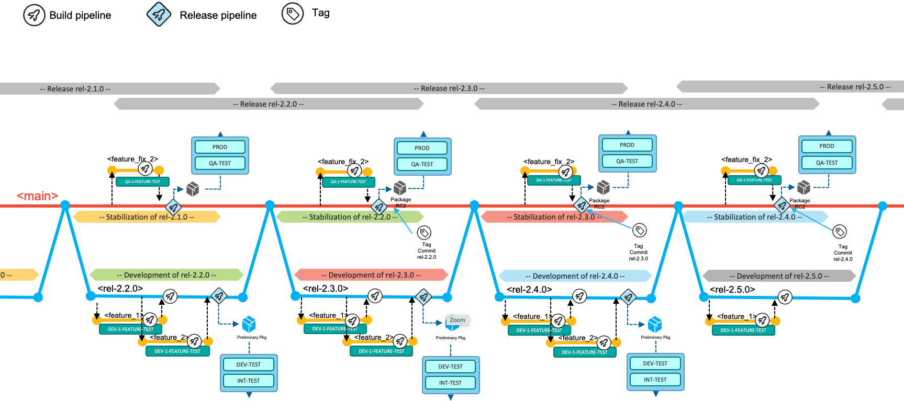

>**September 2023 - Release 1.0**
>
>**The Git-based process you need for mainframe development**
>
>**(Draft Document Sept 1,2023)**  

**Table of contents**

[Introduction](introduction.md#introduction)
[The Git-based development process for Mainframe development](the-git-based-development-process-for-mainframe-development.md#the-git-based-development-process-for-mainframe-development)
[Pipeline design and implementation supporting the workflows](pipeline-design-and-implementation-supporting-the-workflows.md#pipeline-design-and-implementation-supporting-the-workflows)
[Conclusion](conclusion.md#conclusion)
[Appendix](#appendix)
1. [Development Process variations](#development-process-variations)
2. [Working with overlapping releases](#working-with-overlapping-releases)

# Appendix 

## Development Process variations

### Working with overlapping releases

In traditional mainframe development workflows, teams follow a practice of overlapping releases. In that situation, the team leverages the *main* and *epic* branches following a rolling wave pattern: The team decides which commit/tag of the main codeline will be used to baseline the overlapping release -- most likely when the previous release moves into its release stabilization phase. The development phase of the subsequent release then occurs on the epic branch and is merged back into main when entering the stabilization phase. This leads to the below composition of the *main* and *epic* workflow:

