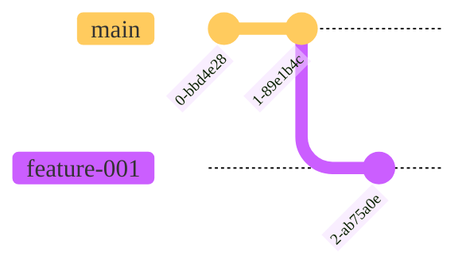
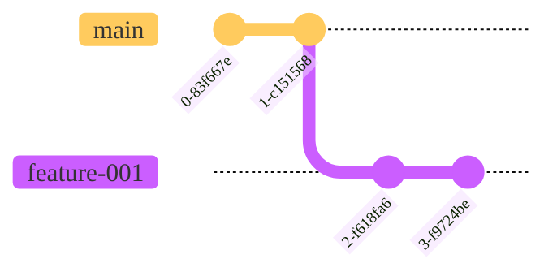
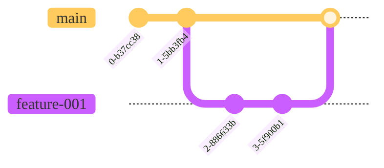
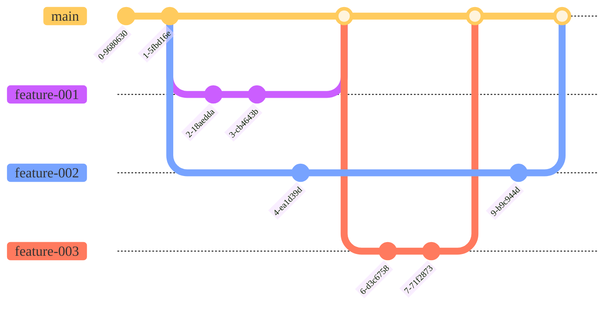

>**September 2023 - Release 1.0**
>
>**The Git-based process you need for mainframe development**
>
>**(Draft Document Sept 1,2023)**  

**Table of contents**

[Introduction](#introduction)

[The Git-based development process for Mainframe development](the-git-based-development-process-for-mainframe-development.md#the-git-based-development-process-for-mainframe-development)

[Pipeline design and implementation supporting the workflows](pipeline-design-and-implementation-supporting-the-workflows.md#pipeline-design-and-implementation-supporting-the-workflows)

[Conclusion](conclusion.md#conclusion)

[Appendix](appendix.md#appendix)

# Introduction

Git branching strategies are patterns to enable development teams using Git to manage their code in a streamlined manner. Since Git is established as a de-facto standard for source-code management in the developers community, several approaches were designed to fulfill users' requirements and manage applications source code lifecycle, with advantages and drawbacks depending on use cases. Based on the experience gained designing branching strategies, this document describes a blueprint implementation of mainline-based development approach for mainframe applications using feature branches with an early integration pattern. This setup leverages a standardized development toolset based on an enterprise-wide Git provider and a Continuous Integration/Continuous Deployment (CI/CD) toolchain.

A characteristic of this integration pattern is that developers are implementing changes for a planned release and integrate their changes into a common permanent branch (the shared configuration) that is built, tested, and released together as one consistent entity.

The purpose of streamlining both the DevOps solutions and the delivery workflow is to simplify the process for development teams to deliver quality product releases on time. This enables agile development practices that allow the teams to respond more effectively to changes in the market and customer needs. The first part of the document introduces the model and outlines the development workflow from the developer's perspective. The details of the technical implementation with IBM Dependency Based Build and zAppBuild as well as packaging and deployment are discussed in the second part. All branching models are adaptable to the needs of specific teams and their applications. This document advocates for best practices and indicates where variations can be applied.

The target audience of this document are Mainframe DevOps architects and SCM specialists interested in learning how to design and implement a CI/CD pipeline with a robust and state-of-the-art development workflow.

## Aims and Assumptions

Some aims and assumptions which guided our recommendations include:

- The workflow and branching scheme should both scale-up and scale-down.
  - Small teams with simple and infrequent changes will be able to easily understand, adopt and have a good experience. 
  - Large busy teams with many concurrent activities will be able to plan, track and execute with maximum agility using the same fundamental principles.

- Planning and design activities as well as code development aim to align to a regular release cadence.

- There is no magic answer to managing large numbers of 'in-flight' changes, so planning assumptions should aim as much as possible to complete changes quickly, ideally within one release cycle.

- We know it is sometimes unavoidable for work to take longer than one release cycle and we accommodate that as a variant of the base workflow.

## Choosing a workflow and branching scheme

Your choice of workflow and the branching scheme which supports it need to take account of your team's needs and characteristics.

Aspects to consider include:

- Size of the team
- Frequency of change
- Granularity of change
- Amount of parallel development
- Formality of release process

Our recommended workflow and branching scheme is flexible enough to scale from small teams with an infrequent pattern of small changes to
large and busier teams with many concurrent projects and projects spanning multiple cycles of a formal release cadence.

## Summary... all of it in one diagram

And then, of course, you can build it up incrementally too...

- Everything starts with a branch:
  

- When on a branch, developers commit changes in isolation:
  

- Every branch can be built and tested.
- When ready, the feature branch can be reviewed and approved to merge into `main`:

- Multiple features can be developed concurrently:

- or serially:

- And then a release candidate can be created:

