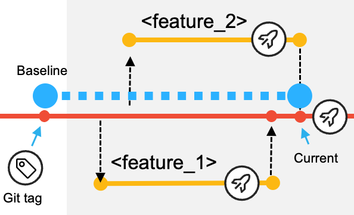
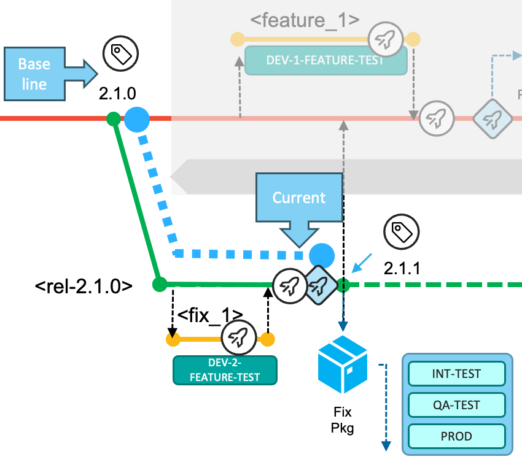
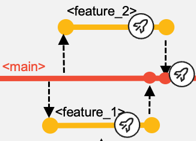

>**September 2023 - Release 1.0**
>
>**The Git-based process you need for mainframe development**
>
>**(Draft Document Sept 1,2023)**  

**Table of contents**

[Introduction](introduction.md#introduction)

[The Git-based development process for Mainframe development](the-git-based-development-process-for-mainframe-development.md#the-git-based-development-process-for-mainframe-development)

[Pipeline design and implementation supporting the workflows](#pipeline-design-and-implementation-supporting-the-workflows)

1. [Configurations to support working with Feature branches](#configurations-to-support-working-with-feature-branches)

    * [User Build setup](#user-build-setup)
  
    * [Pipeline build of feature branches](#pipeline-build-of-feature-branches)
  
    * [Package and Deploy a feature for testing in controlled test environments](#package-and-deploy-a-feature-for-testing-in-controlled-test-environments)
  
2. [House keeping recommendations](#house-keeping-recommendations)

3. [The Build pipeline for main, epic and release branches](#the-build-pipeline-for-main-epic-and-release-branches)

    * [Build pipeline: Build and Test step](#build-pipeline-build-and-test-step)
  
    * [Build pipeline: Install outputs to a shared DEV-TEST runtime](#build-pipeline-install-outputs-to-a-shared-dev-test-runtime)
  
    * [Build pipeline: Analyze step](#build-pipeline-analyze-step)
  
4. [The Release pipeline: Build, package and deploy](#the-release-pipeline-build-package-and-deploy)

    * [Release pipeline: Build stage](#release-pipeline-build-stage)
  
    * [Release pipeline: Packaging stage](#release-pipeline-packaging-stage)

    * [Release pipeline: Deployment stage](#release-pipeline-deployment-stage)
  
5. [Deployment to production](#deployment-to-production)

[Conclusion](conclusion.md#conclusion)

[Appendix](appendix.md#appendix)

# Pipeline design and implementation supporting the workflows 

In this section, the technical implementation of the different composition of pipeline of the outlined development methodology will be detailed. If a workflow demands a specific configuration, it will be covered within the same section.

## Configurations to support working with Feature branches

 When the developers start working on a new task, they will first create a feature branch. Feature branches are created off the latest code state of the state of the source configuration -- the *main*, *epic* or *release* maintenance branch.

If the feature branch was created on the central Git repository, the developers can use the IDE, a terminal, or another Git interface on their local workstation to clone or pull the new feature branch from the central Git repository. They checkout the feature branch inw which the changes will be implemented.

Integrated development environments (IDEs) supported by IBM allow developers to perform a DBB User Build to quickly gather feedback on the implemented changes. This feature is expected to be used before the changes are committed and pushed to the central Git server, where a pipeline can process changes automatically.

### User Build setup

User Build is a feature provided by IBM-supported IDEs that uploads the modified source code and its dependencies from the local, checked-out Git working tree on the developer\'s workstation to a personal directory on z/OS UNIX System Services, and then invokes the build framework to execute the compile and link-edit steps. This capability is available in the following IBM IDEs:

-   IBM Developer for z/OS[^17]

-   VS Code with the IBM Z Open Editor extension[^18]

-   IBM Wazi for Dev Spaces[^19]

The developer configures the User Build process to point to the central build framework implementation, such as zAppBuild[^20], provided by the Mainframe DevOps Team. The build option *\--userBuild*[^21] is passed to the build framework along with the reference to the file the developer would like to build.

Because the operation is performed with the credentials of the currently logged-in user, it is recommended for each developer to reuse the high-level qualifier *(\--hlq*) of their personal datasets. It is the developer's responsibility to regularly clean up the mainframe datasets and sandbox directories on z/OS UNIX System Services that are used for User Build. Automated cleanup of the files can be established based on a defined naming convention for datasets or with a specific storage management policy.

User Build is a convenient way to compile and link-edit source code without committing the changes into the Git version control system. Therefore, build outputs of User Builds are not assumed to be installed into a runtime environment. To be able to perform simple and rudimentary tests on User Build-generated outputs, the developer should modify the test JCLs to point to the personal libraries used in User Builds.

Alternatively, the setup of a pre-concatenated runtime library can be implemented to perform more tests in the context of a (shared) test runtime environment. A dedicated pre-concatenated library in the runtime system (for example, batch, IMS and CICS) into which the developers can write allows a separation of the modules produced by User Builds, and enables regular cleanup of these intermediate versions that are not yet registered in the central Git provider or as a build output in the artifact repository.

External dependencies to other components, such as include files (for example, copybooks or object decks) which are not managed within the application repository, but are required for building the application, can either be pulled in via a dataset concatenation[^22] or by the usage of Git submodules, depending on the repository organization.

Developers regularly commit and push their changes to their feature branch on the central Git provider.

### Pipeline build of feature branches

It is a common practice to use a feature branch pipeline that builds the codebase of a feature branch, and runs automated code inspections using the IDz code review application[^23] or updates the static code analysis repository such as in IBM Wazi Analyze[^24].

This pipeline expands the scope of the build past that of the user build and makes sure all changed and impacted programs are included in the list of artifacts to be produced by leveraging the *--impactBuild* option of zAppBuild. The developer must make sure to have pushed all the commits to the feature branch from their local clone to the central Git provider so they are available to the feature branch pipeline process.

The pipeline configuration requires processing logic to compute a dedicated high-level qualifier to guarantee that build datasets are exclusively used for the provided branch. The computed value is passed into the build command via the *\--hlq* parameter. zAppBuild allocates the datasets automatically.

The build leverages the dependency metadata managed by IBM Dependency Based Build (DBB) via DBB collections, which are consumed by the build framework, zAppBuild. At the first execution of the build process for the feature branches, zAppBuild will duplicate this metadata by cloning the related collections for efficiency purposes[^25]. This cloning phase ensures the accuracy of the dependency information for this pipeline build. To be able to clone the collection, zAppBuild needs to understand which collection contains the most accurate information and must be duplicated. As collection names are derived from the name of the branch, it is easy to identify which collection should be cloned. In the zAppBuild configuration, the originating collection reference is defined via the *mainBuildBranch* property.[^26]

Depending on the type of workflow, the *mainBuildBranch* property needs to be overridden for the feature branch pipeline:

-   In the typical development process working towards the next planned release based on the head of the *main* branch, the default configuration for the *mainBuildBranch* is accurate.

-   When implementing a fix in context of a release maintenance branch, the *mainBuildBranch* requires to be set to the name *release* branch to correctly clone the dependency information.

-   When implementing changes on a feature branch in an *epic* branch context, the *mainBuildBranch* property, needs to be set to the name of the epic branch.

Instead of manipulating the property files that defines the *mainBuildBranch* setting and are part of the repository, the pipeline automation can compute the correct setting and pass the overridden property via the override option cli of zAppBuild[^27].

### Package and Deploy a feature for testing in controlled test environments

Today's mainframe development workflows can allow developers to install their changes into controlled test environments before these changes get assigned into a release -- for instance when the developer would like to prototype/pilot a new feature. On lower environments, there might be multiple CICS regions, which developers can use, that provide a level of isolation from other ongoing development work. The pipeline process can be extended to provide a similar functionality as an optional step for the developer.

This strategy can be called *Feature branch packaging and deployment of a preliminary package*. It is implemented as a dedicated pipeline, that developers request on demand for their feature branch. The pipeline performs the following actions:

-   building all the changes of the feature branch that were implemented including their impacts as outlined in 3.2.1 Build pipeline: Build and Test step using the commit point at which the feature branch was branched of as the baseline reference for calculating the changes, and

-   a packaging step to produce a package of the produced outputs as outlined in 3.3.2 Release pipeline: Packaging stage

The deployment process must ensure that these preliminary packages cannot be deployed into any production environment.

Often, these controlled development test environments are used as shared test environments for multiple application teams. To use the same runtime environment, such as a CICS region, for both prototyping and for testing integrated changes, we recommend separating the preliminary (feature) packages from the planned release packages by separating these types into different libraries. The package for the prototyping workflow is deployed via its dedicated deployment environment model, illustrated in Figure 17 as *DEV-1-FEATURE-TEST*.

Because preliminary packages are intended to be short living and temporary, they can be deployed to a library via the deployment automation process to a pre-concatenated library. Housekeeping strategies must be established to ensure that either automation routines or developers are cleaning up the preliminary packages when the testing is done.

This strategy should be designed with the infrastructure engineering team to prepare the test environments to support this workflow.

### House keeping recommendations 

A house-keeping strategy should be implemented when the feature branch is no longer needed and therefore removed from the central Git provider. Successful merging adds commits from one branch to the HEAD of another and once done, the branch being merged from can be safely deleted -- keeping old branches causes confusion and adds nothing to the traceability of the history. This includes the clean-up of the DBB collections as well as the build workspace on Unix System services and the build datasets.

Specific scripts can be integrated into the pipeline to delete collections and build groups[^28], or unnecessary build datasets[^29]. When leveraging GitLab CI/CD as the pipeline orchestrator, the use of GitLab environments helps to automate these steps when a branch is deleted. An implementation sample is provided via the published technical document *Integrating IBM z/OS Platform in CI/CD Pipelines with Gitlab*[^30]. Generally, webhooks and other extensions of the pipeline orchestrator can be leveraged to perform these clean-up activities when a branch is being deleted.

## The Build pipeline for main, epic and release branches

 It is common practice to build every time the head of the *main*, *epic* or *release* branch is modified.

When a feature branch is merged into a shared branch, a new pipeline is kicked off to build the integrated changes in the context of the configuration of the branch.

Additional steps such as automated code reviews or updates of application discovery repositories can be included in the pipeline process.

### Build pipeline: Build and Test step

The purpose of the Build step of the pipeline for the branch is to ensure that the branch can be built and then tested together. It might happen that some features have indirect dependencies on other features planned for the same deliverable. This early point of integration along with the impact build capability of the build framework[^31] ensures consistency and transparency of the upcoming deliverable.

The build step decouples building from deploying. This is important to ensure that only outputs from successful builds are installed into the test environment, rather than directing the build framework to update the libraries of the test environment directly.

The *Build and Test* stage of the pipeline for the branch builds all the incorporated changes that have so far been merged for the deliverable. To identify the list of changes contributing to the *release*, the *epic* of the *release maintenance*, the build step of the pipeline leverages the *\--baselineRef* option of zAppBuild for incremental builds, which is used to specify a baseline hash or point in the commit history for calculating the list of changes. Using this approach of incremental avoids unnecessarily building parts of the application that are unaffected by any of the changes in the commits to main since the last release.

Also, the pipeline configuration requires a dedicated high-level qualifier to guarantee that build datasets are exclusively used for the provided branch. The value is passed to zAppBuild command via the *\--hlq* parameter.

The option *\--baselineRef* is a sub-parameter of the *\--impactBuild* option in zAppBuild, and sets the base Git hash upon which the *git diff* command calculates changes for the repository[^32].

In the *main* workflow, the hash (the Git tag) of the previous release (that is, the release currently in production) defines the baseline reference:

For the *epic branch* workflow, the baseline reference for the build pipeline is the commit (or Release tag) of which the epic branch was created from, also referred to the fork point.

For the *hotfix* workflow, the baseline reference is the commit (or Git tag) for which are planned to be implemented, like depicted in the below diagram.

### Build pipeline: Install outputs to a shared DEV-TEST runtime

In this phase of the development lifecycle for the common process implementing and delivering changes for the next planned release, the build typically operates with the compile options to enable testing and debugging of the programs[^33]. As most organizations restrict the deployment to the production environments with optimized code only, these build artifacts can be seen as temporary and only for initial testing and debugging purposes.

 There are two options to deploy the generated artifacts to the shared development test system - represented by the green *DEV-TEST* shape in the alongside figure.

(Recommended) Option A - Extend the pipeline with a packaging and deployment step to create a *preliminary package* similar to 3.3.2 Release pipeline: Packaging stage. It traditionally is the responsibility of the deployment solution install the preliminary package into different environments. Doing this in this phase of the workflow, will give the necessary traceability and understanding what versions are installed in the DEV-TEST environment.

Option B - A post-build script can be used to copy the output artifacts from the build libraries to the associated target runtime libraries and manually run the necessary activation steps such as a Db2 bind process or an online refresh. However, even given the temporary nature of the outputs created by this build, this circumvents the formal packaging and deployment process. The major drawback of this approach is a lack of traceability and understanding of what runs on the *DEV-TEST* environment.

This step of the build pipeline is not applicable for pipelines for the epic or the release maintenance branches.

### Build pipeline: Analyze step

An optional step after building the state of the main branch, is to perform automated code inspections using the IDz code review application[^34] or update the static code analysis repository such as in IBM Wazi Analyze[^35].

Submitting a Sonarqube scan at this point of the workflow helps the development team to keep an eye on the maintainability and serviceability of the application.

## The Release pipeline: Build, package and deploy

 This type of pipeline is leveraged by the development team when they want to create a release candidate package that can be deployed to controlled test environments. The development team is manually requesting the pipeline to run. The pipeline is not expected to be used for every merge into the main branch.

The *release pipeline* includes additional steps and differs from the previously discussed pipelines: after the stages of building and code scans have successfully completed, the pipeline packages all the incorporated changes of all merged features for this deliverable to create a package.

The package may be an intermediate release candidate version, as outlined in the high-level flow[^36], that can already be tested in the managed test environments. When the development team has implemented all the tasks planned for the iteration, this same pipeline is used to produce the package that will be deployed to production.

The below diagram outlines the steps of a GitLab pipeline for the build, package and deploy pipeline.

The deploy stage can only be present in pipeline for the main workflows when delivering changes with the next planned release, because the pipeline is unaware of the assigned environments for the *develompment initiative* and *release maintenance* workflows.

### Release pipeline: Build stage

Like the build pipeline outlined in the previous section, the Build stage of the release pipeline builds all the incorporated changes of all merged features. To identify the list of changes contributing to the deliverable, the build step of the pipeline leverages the *\--baselineRef* option of zAppBuild to detect all contributed changes based on rules outlined in *3.2.1 Build pipeline: Build and Test step*.

For the *main* and the *release* workflow, this build performs the compilation with the compiler options to produce executables optimised for performance. The pipeline must leverage its dedicated set of PDS libraries to not interfere with the *build pipeline*.

For the epic branch workflow, the build can occur with the TEST options, because package is only deployed into the initiatives test environment and will be rebuilt when the epic branch is integrated into the main branch.

### Release pipeline: Packaging stage

The Packaging step runs after the Build and Test step and creates a package of the generated build outputs (for example, load modules, DBRMs, and JCLs). This package includes the build outputs of all the contributed changes (including the files impacted by the changes) for the deliverable. It represents a release candidate, which can be deployed into the various test environments along the existing staging hierarchy. As outlined in the high-level workflow, this can even happen when only a subset of the features for the deliverable is implemented.

The name or associated metadata of the package allows to relate the package to the development workflow. Based on naming conventions of the package, different rules need to apply for the lifecycle of it:

-   Use *rel-2.1.0_RC01* for a release candidate package for the next planned release.

    The package name is representing the name of the next planned release. This package can make it to production, because it contains build outputs produced with the optimize option.

-   Use *rel-2.0.1-patch_RC01* for an urgent fix package of the current production version.

    This package is allowed to bypass any concurrent development activities and can take shortcuts in the route to production, i.e. if it can only be tested on the QA-TEST environment, the user can bypass lower test environments based on an "emergency" flag of the deployment package.

-   Use *epic1-prelim_pkg01* for a preliminary package of a long-running epic branch workflow. This package can only be deployed to the assigned test environments available to the initiative and not be deployed to production.

The packaging step not only creates the binaries package, but it also carries information about the source code, such as the Git commit and additional links (including references to the pipeline job), which are helpful for understanding the context of the creation of the package.

The Dependency Based Build community repository[^37] contains two sample scripts that implement the Packaging step. If IBM UrbanCode Deploy is used as the deployment solution, the *CreateUCDComponentVersion* script[^38] can be leveraged to create a IBM UrbanCode Deploy component version. Alternatively, if a scripted deployment is being set up, the *PackageBuildOutputs* script[^39] can be used instead to store artifacts in an enterprise binary artifact repository and is leveraged by IBM Wazi Deploy[^40].

Both sample scripts leverage data from the DBB Build Report to extract and retain the metadata, allowing traceability between the build and deployment activities as outlined above.

### Release pipeline: Deployment stage

The deployment process of a release package for the main workflow can either be triggered from the CI/CD pipeline or driven through the user interface of the deployment solution. The implementation can vary, based on the capabilities offered by the CI/CD orchestrator and the deployment solution. Deployment manager options for z/OS include IBM UrbanCode Deploy (UCD) and IBM Wazi Deploy.

IBM UrbanCode Deploy (UCD) provides a rich web-based interface, powerful REST APIs, and command-line interfaces. Typically, the pipeline execution requests the deployment of the application package into the defined test environments automatically, after successful completion of the preceding building and packaging steps. These requests are performed through the REST APIs provided by UCD. However, if the application team prefers to set up manual triggers for the deployments to the specific environments, this can be performed through the Web interface of UCD. In that case, the pipeline is primarily used for continuous integration and packaging.

The DBB Community repository provides a sample *DeployUCDComponentVersion* script[^41] to request a UCD application deployment leveraging UCD's REST APIs that can be included into a pipeline process.

IBM Wazi Deploy as a deployment manager comes with a command-line interface that can be easily invoked from a pipeline orchestrator and does not require a wrapper script: After the deployment package is retrieved from the Artifact repository, the *wazideploy-generate* step generates the deployment instructions -- the deployment plan - for the artifacts of the package, which is passed into the process, before the *wazideploy-deploy* step installs the contents of the package into the specified runtime environment[^42].

 In a GitLab CI/CD implementation, a pipeline can stay on hold and wait for user input. This allows the pipeline to automatically trigger the deployment of the application package into the first configured environment, and lets the application team decide when to deploy to the next environment through a manual step (for instance, deployment to the Acceptance environment).

With Jenkins as the CI/CD orchestrator, it is not common to keep a pipeline in progress over a long time. In this case, the pipeline engineering team might consider the approach of requesting the deployments through the user interface of the deployment solution or alternatively a *deployment pipeline* in Jenkins that can be designed and set up to combine the deployment with any automated tests or other automation tasks.

## Deployment to production 

When the release candidate package has passed all quality gates and received all the necessary approvals, it is ready be deployed to the production environment.

The release manager takes care of this step of the lifecycle and will leverage the user interface of the deployment manager -- such as UCD's browser-based interface. In the case of a deployment manager solution with a command-line interface, such as Wazi Deploy, the user interface of the pipeline orchestrator is used by the release manager to drive the deployment to production. A *deployment pipeline* definition needs to be configured to rollout the package.

Deploying to production consists of two tasks:

1.  Invoking the deployment to the production runtime environment through either the deployment manager interface or a deployment pipeline definition.

2.  And an additional step to tag the commit in the Git server by assigning a Git tag to the commit which was used to build the release package.

    Most Git providers allow for the creation of a release to provide a summary of the changes, as well as additional documentation. GitLab[^43] and GitHub[^44] offer a REST API to create a new tag/release. This action should be automated as part of the deployment to production.

    As an example, for using Git tags: zAppBuild also declares releases to identify stable versions: <https://github.com/IBM/dbb-zappbuild/releases/tag/3.2.0>

[^17]: IBM Developer for z/OS - <https://www.ibm.com/docs/en/developer-for-zos>

[^18]: IBM Z Open Editor - <https://www.ibm.com/docs/en/cloud-paks/z-modernization-stack/2022.2?topic=ide-option-2-developing-vs-code>

[^19]: IBM Wazi for Dev Spaces - <https://www.ibm.com/docs/en/cloud-paks/z-modernization-stack/2022.2?topic=ide-option-1-developing-codeready-workspaces>

[^20]: <https://github.com/IBM/dbb-zappbuild>

[^21]: zAppBuild user build implementation - <https://github.com/IBM/dbb-zappbuild/blob/3.2.0/docs/BUILD.md#build-a-single-program>

[^22]: zAppBuild Configuration - <https://github.com/IBM/dbb-zappbuild/blob/3.2.0/samples/application-conf/Cobol.properties#L83-L89>

[^23]: Sample script to integrate IDZ Code Review in a pipeline

    <https://github.com/IBM/dbb/tree/v2.0.0/Pipeline/RunIDZCodeReview>

[^24]: Introduction to IBM Wazi Analyze <https://www.ibm.com/docs/en/addi/6.1.2?topic=wazi-analyze-user-guide>

[^25]: zAppBuild documentation - <https://github.com/IBM/dbb-zappbuild/blob/3.2.0/docs/BUILD.md#perform-impact-build-for-topic-branches>

[^26]: IBM DBB zAppBuild Sample Build Framework Implementation -- Impact Builds for topic branches

    https://github.com/IBM/dbb-zappbuild/blob/3.2.0/docs/BUILD.md#perform-impact-build-for-topic-branches

[^27]: zAppBuild -- Dynamcially Override build properties --

    <https://github.com/IBM/dbb-zappbuild/blob/3.3.0/docs/BUILD.md#dynamically-overwrite-build-properties>

[^28]: IBM DBB Community Repository - <https://github.com/IBM/dbb/tree/main/Utilities/WebAppCleanUp>

[^29]: IBM DBB Community Repository - <https://github.com/IBM/dbb/tree/main/Utilities/DeletePDS>

[^30]: IBM Whitepaper - <https://www.ibm.com/support/pages/integrating-ibm-zos-platform-cicd-pipelines-gitlab>

[^31]: See zAppBuild \--impactBuild - <https://github.com/IBM/dbb-zappbuild/blob/3.2.0/docs/BUILD.md#perform-impact-build>

[^32]: zAppBuild implementation to set baselineRef -

    <https://github.com/IBM/dbb-zappbuild/blob/3.2.0/docs/BUILD.md#perform-impact-build-by-providing-baseline-reference-for-the-analysis-of-changed-files>

[^33]: zAppBuild is providing the *\--debug* flag to build programs with the Test options -- see <https://github.com/IBM/dbb-zappbuild/blob/3.3.0/docs/BUILD.md#common-pipeline-invocation-examples>

[^34]: Sample script to integrate IDZ Code Review in a pipeline

    <https://github.com/IBM/dbb/tree/v2.0.0/Pipeline/RunIDZCodeReview>

[^35]: Introduction to IBM Wazi Analyze <https://www.ibm.com/docs/en/addi/6.1.2?topic=wazi-analyze-user-guide>

[^36]: See step 6 in 2.3 Workflows in this development strategy

[^37]: DBB Community Repository - <https://github.com/IBM/dbb>

[^38]: Create UCD component version - <https://github.com/IBM/dbb/tree/main/Pipeline/CreateUCDComponentVersion>

[^39]: Package Build outputs - <https://github.com/IBM/dbb/tree/main/Pipeline/PackageBuildOutputs>

[^40]: Wazi Deploy Workflow - <https://www.ibm.com/docs/en/developer-for-zos/16.0?topic=deploy-wazi-workflow>

[^41]: Request Application Deployment Sample Script - <https://github.com/IBM/dbb/tree/main/Pipeline/DeployUCDComponentVersion>

[^42]: IBM Wazi Deploy -- Static Deployment Workflow

    <https://www.ibm.com/docs/en/developer-for-zos/16.0?topic=deploy-getting-started-static-deployment>

[^43]: GitLab REST API -- Create Release <https://docs.gitlab.com/ee/api/releases/>

[^44]: GitHub REST API -- Create Release <https://docs.github.com/en/rest/releases/releases>
