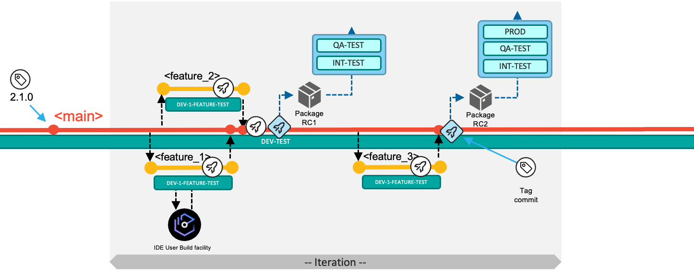
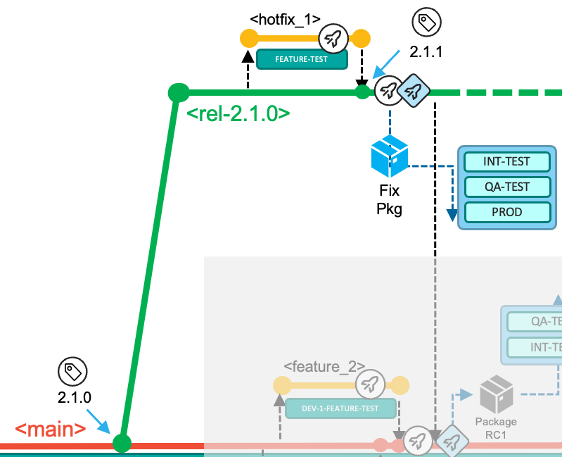

>**September 2023 - Release 1.0**
>
>**The Git-based process you need for mainframe development**
>
>**(Draft Document Sept 1,2023)**  

**Table of contents**

[Introduction](introduction.md#introduction)

[The Git-based development process for Mainframe development](#the-git-based-development-process-for-mainframe-development)

1. [Characteristics of mainline-based development with feature branches](#characteristics-of-mainline-based-development-with-feature-branches)

    * [Naming conventions](#naming-conventions)
  
    * [Integration branches](#integration-branches)
  
2. [Workflows in this development strategy](#workflows-in-this-development-strategy)

    * [Deliver changes with the next planned release](#deliver-changes-with-the-next-planned-release)
  
    * [Implement a fix of the current production state](#implement-a-fix-of-the-current-production-state)
  
    * [Use epic branches for significant development initiatives](#use-epic-branches-for-significant-development-initiatives)
  
[Pipeline design and implementation supporting the workflows](pipeline-design-and-implementation-supporting-the-workflows.md#pipeline-design-and-implementation-supporting-the-workflows)

[Conclusion](conclusion.md#conclusion)

[Appendix](appendix.md#appendix)

# The Git-based development process for Mainframe development

As Git became the de-facto version control system in today's IT world, new terminologies such as [*repositories*](https://git-scm.com/book/en/v2/Git-Basics-Getting-a-Git-Repository), [*branches*](https://git-scm.com/book/en/v2/Git-Branching-Branches-in-a-Nutshell), and *merges* arose. By agreeing upon a central Git server to integrate and consolidate changes, development teams were able to collaborate more efficiently and effectively. Building upon the open-source vanilla Git implementation, popular Git providers including GitHub, GitLab, and Bitbucket have implemented additional workflow features to facilitate a secure and stable development process. These include features such as *Pull Requests* (sometimes referred to as *Merge Requests*) to support coordination with Git in larger teams. The term *Pull Request* will be used throughout this document to designate the operation of reviewing and merging one branch into another.

Many mainframe development teams follow a release-based or iteration-based process to deliver incremental updates to a pre-defined production runtime.

## Characteristics of mainline-based development with feature branches 

As mentioned in the [Introduction](introduction.md) our recommended approach scales very well to support the needs of a range of team sizes, frequency and size of changes, and degrees of concurrent working.

### Starting simple

The mainline-based development approach[^3] with *feature* branches is a simple and structured workflow to implement, integrate, and deliver changes with an early integration process flow using a single long-living branch: *main*. Developers work in isolation in *feature* branches to implement changes to the source code, and ideally test the changes in a specific environment.

This approach can be compared to a trunk-based branching model that leverages feature branches. A similar workflow like outlined in this publication is also documented by Microsoft without giving it a name[^5].

<!-- this paragraph would make an ideal 'annotation', callout or sidebar if writing for an SSG like Mkdocs. -->
(You may also see reference to *topic* branches, for example [here](https://git-scm.com/book/en/v2/Git-Branching-Branching-Workflows). Feature branches can be considered as one sub-type of *topic* branches with branches for *bug-fixes* being another sub-type. Both feature branches and bug-fix branches are expected to be relatively short-lived and ultimately to merge into a long-lived branch.)

The `main` branch is the point of reference for the entire history of the mainline changes to the code base. `main` should be a *protected* branch - **all** changes originate on a branch created to hold them until they are ready to be merged. Using a branch-and-merge approach is natural in a git-based SCM and very light-weight both in terms of resource consumption and developer experience.

#### All changes start on a dedicated branch

Although all git-based Devops services provide direct access to the server copy of the repo, developers will typically use an IDE of their choice to work locally on a *clone* of the repo. Standard practices ensure developers' local clones are synchronized with the server copy (typically known as the *remote*) through actions known as `pull` and `push`.

In a small team where there is almost never more than one change in progress at a time, using a branch enables the developer to make the changes in a series of commits rather than as one atomic change as they edit source and save files. Of course, the 'one-line' change might mean there genuinely is only one commit that needs merging, but the process is so natural and light-weight that it's not worth making that a special case.

Such branches are able to be built prior to merging - this can eliminate the possibility of the merge breaking the build of `main` so reducing risk in making changes.

#### Merging a branch

A branch holds all the commits for a change - be that a single commit for a one-liner or a sequences of commits as the developer refined the changes making them ready for review and merging into `main`.

The request to merge a branch is made explicitly, but can be as formal or informal as needed by the team. Protection of `main` can mean that only certain people can perform the merge, or that a review of the changes has approved them, or both.

The action of merging can either simply take all the commits from the branch and add them to `main` or the multiple commits in the branch can be *squashed* into one commit - the latter can keep the overall history on `main` 'cleaner' if that's important to the team.

`main` will always build - and the team can choose when to package and deploy.

### Scaling-up

The use of branches for concurrently planned activities scales extremely well for busier teams. Additionally, *epic*[^4] and *release maintenance* branches accommodate specific development workflows and allow the model to scale even further. The latter two branches exist for the duration of the epic or release maintenance and are short living branches.

The implemented changes of the iteration are then delivered collectively as part of the next release. Each development team decides how long an iteration is: we advocate for working towards smaller, quicker release cycles, but this model can also be used with longer iterations. Due to business or technical reasons, the merging of features into the *main* branch can also be delayed. Although being a discouraged practice, the recommendation is to group such features in a specific epic branch, as described later.

The strategy leverages Git tags to identify the various configurations/versions of the application, such as a release candidate or the version of the application repository which is deployed to production.

Depending on the type of change, the development workflow can vary. In the standard scenario, developers use the *main* branch to deliver changes for the next planned release, while the *release maintenance* branches allow fixing the current release running in the production runtime environment(s). Using *epic* branches is optional for development teams, but allow teams to increase the concurrency of working on multiple, larger development initiatives of the application and represent a grouping mechanism of multiples features that should be built and tested together. The *epic* branch also represents a way to manage the lifecycle of features that are not planned for the next planned release. So, it is a vehicle to delay merging the set of features into the *main* branch for a later time.

The *main*, *epic* and *release* branches are assumed to be protected branches, meaning that no developer can directly push changes to these configurations. It requires developers to make changes on a feature branch and go through the Pull Request process. Before merging the feature branch into a shared branch (whether it is the *main* branch or an *epic* branch), some evidence should be gathered to ensure quality and respect of the coding standards in the enterprise. Peer-reviewed code, a clean pipeline execution, and approvals are examples of such evidence, allowing the development team to confidently merge the feature branch into the target branch. In a Continuous Integration workflow, integrations are expected to happen early to avoid delaying merging conflicts or merges leading to an unstable build.

### Naming conventions

Consistent naming conventions help to indicate the context for the work that is performed. Throughout this document the following naming patterns are used:

-   *main* - the only long-living branch which is the only branch from which every release is initially derived,

-   *release/rel-2.0.1* a release maintenance branch for the *rel-2.0.1* release,

-   *epic/aiFraudDetection* where *aiFraudDetection* is describing the initiative context (in this example, an initiative to adopt AI technology for fraud detection).

Feature branches also need to relate back to the change request (or issue) from the planning phase and their context:

-   *feature/newMortgageCalculation* for a planned feature for the next planned release,

-   *hotfix/rel-2.0.1/fixMortgageCalculation* for a fix of the current production version that is running the *rel-2.0.1 release,*

-   *aiFraudDetection/IntroduceAIModelToMortgageCalculation* for a contribution to the development initiative for adopting AI technology for fraud detection.

A common, recommended practice is to squash the different commits created on the feature branch into a single new commit when merging, which keeps the Git history from becoming cluttered with intermediate work for the feature. This also helps to maintain a tidy history on the *main* branch with only the important commits.

### Integration branches

Specific branches, such as *main*, *epic* and *release* branches, can be seen as integration branches, because their purpose is to integrate changes from other branches (typically feature branches). To drive the integration process of changes into a shared code, mechanisms like Pull Requests are a convenient way as they guide the developers with a streamlined workflow. The number of integration branches required for your development process depends on the needs of the application team. However, the cost of creating new branches is low, but keeping them up-to-date, for instance by integrating release bugfixes from the stabilization phase into concurrent epic branches, can be expensive.

For application teams who want to embrace an agile development methodology and that sequentially deliver new releases with limited parallel development initiatives, they can use the *main* branch and, optionally, the *release* maintenance branch as integrations branches to implement the next planned release and potential bug fixes.

If the development teams require to work on a significant development initiative, in parallel to the standard scenario of the next planned release, this model allows isolation using the *epic* branch workflow. The epic branch is representing an additional integration branch that is used to implement, build, and test multiple features that are planned for the development initiative and can be merged into the *main* branch at a later time. The team decides which commit/tag of the codebase in the *main* branch will be used for the *epic* branch, though it is recommended to start from the last tag for the *main* branch.

When the work items that are implemented on the *epic* branch is planned and ready to be delivered as part of the next planned release, the development team merges the *epic* branch into the *main* branch.

The usage of *epic* branches can compose various styles of development processes. The section 4.1 Development Process variations provides additional samples.

## Workflows in this development strategy

The model facilitates three different types of development workflows:

-   With a single long-living branch, the development process allows developers to work and focus on the next planned release. After planning the work items for the next release, the development team is adding changes to the *main* branch. This is the default development workflow.

This Git branching strategy also facilitates:

-   resolution of a production problem in the currently-released version of the application by leveraging a *release* branch that is used for maintenance purposes,

-   concurrent development activities for significant solution development initiatives, which include multiple planned work items for a later delivery (including starting development of a future release) by creating an *epic* branch from a commit point in the history of *main*.

Git tags are used throughout this process to indicate and label important commits, like the commit of a release that is built from the *main* branch, or a maintenance release created from a *release* maintenance branch.

The next sections outline the various tasks and activities performed by the development team in the context of the above three scenarios.

### Deliver changes with the next planned release 

The below diagram depicts the typical workflow to deliver changes for the next planned release. In the default workflow, the development team commits changes to the head of the main branch. The changes of the next planned release are built, packaged, and released off the main branch.

Developers implement their changes by committing to short-living feature branches (visualized in yellow) and integrate those via Pull Requests into the long-living *main* branch, which is configured to be a protected branch.

At a high level, the development team works through the following tasks:

1.  New work items are managed in the backlog. The team decides which work items will be implemented in the next iteration. Each application team can decide about the duration of the iteration (which can also be seen as the development cycle). In the above diagram, three work items were selected to be implemented for the next iteration. The development team is responsible for coordinating if features are demanding to be implemented in a specific order.

2.  For each work item, a feature branch is created according to pre-defined naming conventions, allowing the assigned developers to have a copy of the codebase on which they can work in isolation from other concurrent development activities.

    

3.  To start making the necessary modifications for their development task, developers create a copy of the Git repository on their local workstations through the clone operation of Git. To synchronize their local Git repository with the central Git repository, they fetch or pull updates into their local clone of the repository. With this process, developers make the feature branch available in their local clone (feature branches created locally can then be pushed to the central Git server).

4.  They use the Dependency Based Build (DBB) *User Build* facility of their integrated development environment (IDE) to validate the changes before committing the changes to their branch and pushing the updates to the central Git repository.

5.  Developers test their changes before integrating them to the shared codebase. They can test the build outputs of the user build step. For a more integrated experience, the CI/CD pipeline orchestrator can be configured to run a pipeline for the feature branch on the central Git server each time the developers push their committed changes to it. This process will start a consolidated build that include the changed and impacted programs within the application scope. Unit tests can be automated for this pipeline, as well. To even further continue testing the feature before merging them, the developer might want to validate the build results in a controlled test environment, which is made possible by an optional process to create a *preliminary package for the feature branch* as outlined in *3.1.3 Package and Deploy a feature for testing in controlled test environments.*

6.  This model is also known as a continuous integration model to reduce merge conflicts. While developing on the feature branch, a common practice is that developers regularly sync their feature branch with the main branch by merging the recent changes from the main branch into their feature branch to make sure to operate on a recent state of main and to identify any conflicts, that they need to resolve in the feature branch.

7.  When developers feel their code changes are ready to be integrated back into the shared main branch, they create a Pull Request to integrate the changes from their feature branch into the *main* branch. The changes must be buildable. The Pull Request process provides the capability to add peer review and approval steps before allowing the changes to be merged.

8.  Once the Pull Request is merged into the *main* branch, the next pipeline execution of the [*build pipeline*](pipeline-design-and-implementation-supporting-the-workflows.md#the-build-pipeline-for-main-epic-and-release-branches) will build all the changes (and their impacts) of the iteration based on the *main* branch.

      

    The pipeline can optionally include a step to deploy the built artifacts (load modules, DBRMs, etc.) into a shared test environment, as highlighted by the green *DEV-TEST* icon in the diagram. In this *DEV-TEST* environment, the development team can validate their combined changes. This first test environment helps support a shift-left testing strategy by providing a sandbox with the necessary setup and materials for developers to test their changes early. The installation happens through the packaging and deployment process of a preliminary package that cannot be installed to higher environments (because it is compiled with the TEST options), or alternatively through a simplified script solution performing a copy operation. In the latter, no inventory and no deployment history of the *DEV-TEST* system exist.

9.  In the outline of this scenario, the development team decides after implementing feature 1 and feature 2 to progress further in the delivery process and build a release candidate package based on the current state of the *main* branch. This point in *main's* history is tagged to identify it as a release candidate.

    

    With this decision, they manually run the [*release pipeline*](pipeline-design-and-implementation-supporting-the-workflows.md#the-release-pipeline-build-package-and-deploy). This pipeline rebuilds the contributed changes for this iteration - with the compiler options to produce executables optimized for performance rather than for debug. The pipeline includes an additional step to package the build outputs to create a release candidate package, that is stored in a binary artifact repository.

10. The release candidate package is installed to the various test stages and takes a predefined route. The process can be assisted by the pipeline orchestrator itself, or the development team can use the interfaces of the deployment solution. In the event of a defect being found in the new code of the release candidate package, the developer creates a feature branch from the *main* branch, corrects the issue, and merges it back into the *main* branch. It is expected that the new release candidate package with the fix is required to pass all the quality gates and to be tested again.

11. In this sample walkthrough of an iteration, the development of the third work item (feature 3) is started later. The same steps as above apply for the developer of this work item. After merging the changes back into the *main* branch, the team is leveraging the *build pipeline* to validate the changes in the DEV-TEST environment. To create a release candidate package, they make again use of the *release pipeline*. This package now includes all the changes delivered for this iteration -- feature 1, feature 2 and feature 3.

    

12. When the release is ready to be shipped after all quality gates have passed successfully and the required approvals have been issued by the appropriate reviewers, the deployment of the package from the binary repository to the production runtime is performed via the deployment manager or is initiated from the [release pipeline](pipeline-design-and-implementation-supporting-the-workflows.md#deployment-to-production).

13. Finally, during the release process to the production environment, the state of the repository (commit) from that the release candidate package was produced of is tagged following a semantic versioning strategy. This serves the purpose of identifying what is currently in production, and also serves as the baseline reference for the calculation of changes for the next release.

### Implement a fix of the current production state

The process of urgent fixes for modules in the production environment follows the fix-forward approach, rather than rolling back the affected modules and reverting to the previous deployed state.

The below diagram depicts the maintenance process to deliver a fix or maintenance for the active release in production of the application. The process leverages a *release* maintenance branch to control and manage the fixes. The purpose of the branch is to add maintenance to a release that is already deployed to the production environment. It does not serve the process to add new functionality to a future release, which is covered by the standard path (2.3.1) or the usage of an epic branch (2.3.3).

The development team works through the following tasks:

1.  In the event of a required fix or urgent maintenance for the production runtime which is currently running the *rel-2.1.0* release, the development team creates a *release/rel-2.1.0* branch based on the existing Git tag in the central Git server. The release branch is a protected branch and does not allow developers to directly push commits to this branch.

2.  For each necessary fix, a feature branch is created according to pre-defined naming conventions (for example, release/*rel-2.1.0/fix_1*, based on the *release/rel-2.1.0* branch). This allows the assigned developer to have a copy of the codebase on which they can work in isolation from other development activities.

      

3.  The developers fetch the feature branch from the central Git repository into their local clone of the repository and switch to the branch to start making the necessary modifications. They leverage the user build facility of their IDE to vet out any syntax issues. They can use a *feature branch pipeline* to build the changed and impacted files. Optionally, the developer can prepare a [preliminary package](pipeline-design-and-implementation-supporting-the-workflows.md#package-and-deploy-a-feature-for-testing-in-controlled-test-environments), which can be used for validating the fix in a controlled test environment.

4.  The developer initiates the Pull Request process, which provides the ability to add peer review and approval steps before allowing the changes to be merged into the *rel-2.1.0* branch.

5.  A [*build pipeline*](pipeline-design-and-implementation-supporting-the-workflows.md#the-build-pipeline-for-main-epic-and-release-branches) for the release maintenance branch will build all the changes (and their impacts).

      

6.  The developer requests a [*release pipeline*](pipeline-design-and-implementation-supporting-the-workflows.md#the-release-pipeline-build-package-and-deploy) for the *release/rel-2.1.0* branch that builds the changes and includes the packaging process to create the fix package for the production runtime. The developer will test the package in the applicable test environments.

7.  After collecting the necessary approvals, the fix package can be deployed to the [production environment](pipeline-design-and-implementation-supporting-the-workflows.md#deployment-to-production). To indicate the new state of the production runtime, the developer creates a Git tag *2.1.1* for the commit that was used to create the fix package to indicate the currently-deployed version of the application.

8.  Finally, the developer is responsible to start the Pull request process to merge the changes from the *release/rel-2.1.0* branch back to the *main* branch to also include the fix into the next release.

9.  The *release/rel-2.1.0* branch is retained for the case of another fix of the active release. The release maintenance branches become obsolete, when the next planned release (represented by a recent commit of the main branch) is deployed to production. In this event, the new commit point on the main branch becomes the baseline for a new release maintenance branch.

### Use epic branches for significant development initiatives

Let's now focus on change requests that represent significant work effort and require major changes, for instance, due to updates in regulatory frameworks in the banking or insurance industry, or the need to already kick off the development phase of features not planned to be delivered in the very next release.

In these situations, the development team cannot follow the business-as-usual workflow to deliver functionality with the next planned release, because the time and work required breaks out of the traditional durations of one release. For each of these scenarios, the development is using an *epic* branch to keep the changes in multiple features separated from the other development activities. It is an integration branch to group and integrate multiple features, that are planned for this initiative. Ideally, the team got a dedicated test environment assigned (such as *PROJ-DEV-TEST* and *PROJ-INT-TEST* runtime), to also plan and implement any infrastructure updates such as Db2 schema changes.

Trunk-based development suggests using feature flags within the code to implement complex features via the main workflow, but to activate them later. We don't see this as a common practice for traditional mainframe languages such as COBOL or PLI, although some development organizations may have applied this practice in mainframe development. Feature flags are often employed so that a given business functionality can be activated at a given date, but be implemented and deployed earlier (whether to dev/test or production environments).

All these scenarios lead to the requirement on the development process to implement changes independently from the main workflow (see 2.3.1).

Note that the *epic* branch workflow described in this section is not meant to be used for a single, small feature that a developer wants to hold back for an upcoming release. In those smaller cases, the developer retains the feature branch until the change is planned to be released.

The development tasks for a development initiative are:

1.  The team creates an *epic* branch, e.g. *epic/epic1234*, from the Git tag representing the current production version of the application, which is at this point the most stable configuration. This process provides them isolation of the codebase from any other ongoing changes for the next iteration(s).

2.  Based on how the work items are distributed between the developers, a feature branch is created according to pre-defined naming conventions such as *epic/epic1234/feature4*, *epic/epic1234/feature5* based on the *epic/epic1234* branch.

3.  The developers fetch the feature branch from the central Git repository into their local clone of the repository and start making the necessary modifications. They leverage the user build facility of their IDE for building and testing individual programs. They can also leverage *a feature branch pipeline* to build the changed and impacted files. Optionally, the developer can prepare a preliminary package, which can be used for validating the fix in a controlled test environment, such as a [EPIC-1-FEATURE-TEST environment](pipeline-design-and-implementation-supporting-the-workflows.md#package-and-deploy-a-feature-for-testing-in-controlled-test-environments).

      

4.  The developer initiates the Pull Request process, which provides the ability to add peer review and approval steps before allowing the changes to be merged into the *epic* branch.

5.  A [*build pipeline*](pipeline-design-and-implementation-supporting-the-workflows.md#the-build-pipeline-for-main-epic-and-release-branches) for the epic branch will build all the merged features (changes and their impacts) from the point the epic branch was branched off.

6.  It is mandatory, that the team is frequently incorporating updates which got implemented for the next release or got released to production via the standard development process via the *main* branch into the *epic* branch to avoid that the configurations diverge too much and make the planned merge hard. A common practice is to at least integrate changes after each completion of a release via the main workflow (See Figure 15) to merge the stable versions. More frequent integrations may lead to pulling intermediate versions of features, which may not be fully implemented from a business perspective; however, this should not deter developers since the main branch should always be in a buildable state.

7.  When the development team feels that they are ready to prototype the changes for the initiative in the initiatives' test environment, they request a [*release pipeline*](pipeline-design-and-implementation-supporting-the-workflows.md#the-release-pipeline-build-package-and-deploy) for the *epic* branch that builds the changes and includes the packaging process to create a preliminary package that can be installed into the initiative test environment (for example the *EPIC-DEV-TEST* environment). The team will test the package in the assigned test environments for this initiative.
                    
      

8.  The development team plans to integrate the changes of the *epic* branch into the main branch using the Pull Request process. This happens, when the changes should be released towards production with the next planned iteration. The below diagram depicts of the process of integrating the changes implemented for *epic1* in parallel of the main workflow after three releases.

