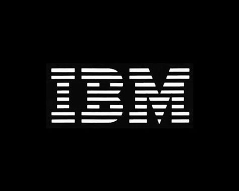
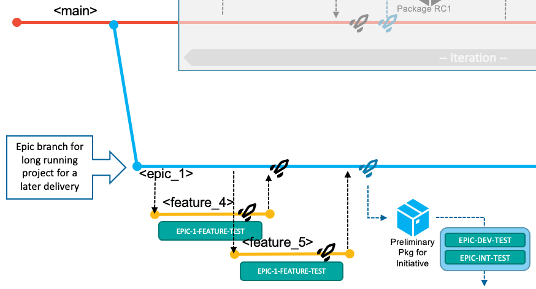
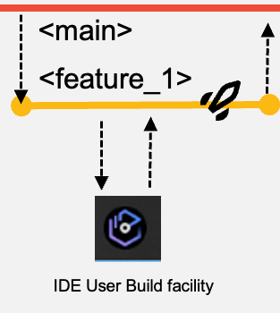
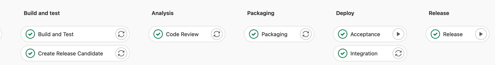
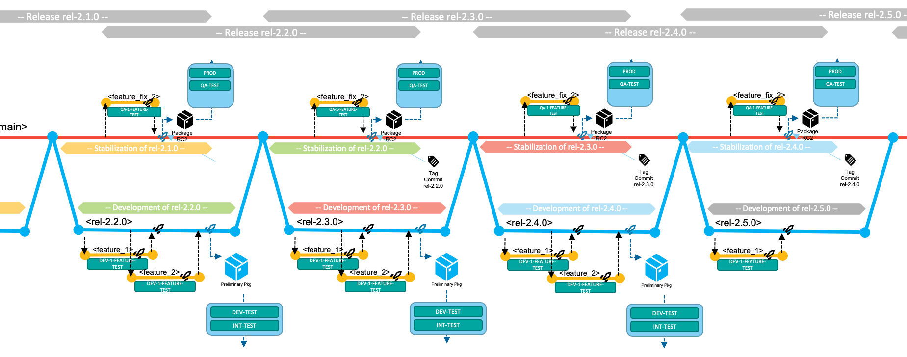

{width="3.609722222222222in" height="10.9875in"}

> **September** **2023 - Release 1.0**
>
> **The Git-based process you need for mainframe development**

**(Draft Document Sept 1,2023)**

**\
**

**Table of contents**

[1 Introduction](#introduction)

[2 The Git-based development process for Mainframe development](#the-git-based-development-process-for-mainframe-development)

[2.1 Introduction](#introduction-1)

[2.2 Characteristics of mainline-based development with feature branches](#characteristics-of-mainline-based-development-with-feature-branches)

[2.2.1 Naming conventions](#naming-conventions)

[2.2.2 Integration branches](#integration-branches)

[2.3 Workflows in this development strategy](#workflows-in-this-development-strategy)

[2.3.1 Deliver changes with the next planned release](#deliver-changes-with-the-next-planned-release)

[2.3.2 Implement a fix of the current production state](#implement-a-fix-of-the-current-production-state)

[2.3.3 Use epic branches for significant development initiatives](#use-epic-branches-for-significant-development-initiatives)

[3 Pipeline design and implementation supporting the workflows](#pipeline-design-and-implementation-supporting-the-workflows)

[3.1 Configurations to support working with Feature branches](#configurations-to-support-working-with-feature-branches)

[3.1.1 User Build setup](#user-build-setup)

[3.1.2 Pipeline build of feature branches](#pipeline-build-of-feature-branches)

[3.1.3 Package and Deploy a feature for testing in controlled test environments](#package-and-deploy-a-feature-for-testing-in-controlled-test-environments)

[3.1.4 House keeping recommendations](#house-keeping-recommendations)

[3.2 The Build pipeline for main, epic and release branches](#the-build-pipeline-for-main-epic-and-release-branches)

[3.2.1 Build pipeline: Build and Test step](#build-pipeline-build-and-test-step)

[3.2.2 Build pipeline: Install outputs to a shared DEV-TEST runtime](#build-pipeline-install-outputs-to-a-shared-dev-test-runtime)

[3.2.3 Build pipeline: Analyze step](#build-pipeline-analyze-step)

[3.3 The Release pipeline: Build, package and deploy](#the-release-pipeline-build-package-and-deploy)

[3.3.1 Release pipeline: Build stage](#release-pipeline-build-stage)

[3.3.2 Release pipeline: Packaging stage](#release-pipeline-packaging-stage)

[3.3.3 Release pipeline: Deployment stage](#release-pipeline-deployment-stage)

[3.4 Deployment to production](#deployment-to-production)

[Conclusion [25](#_Toc144461971)](#_Toc144461971)

[4 Appendix](#appendix)

[4.1 Development Process variations](#development-process-variations)

[4.1.1 Working with overlapping releases](#working-with-overlapping-releases)

# Introduction

Git branching strategies are patterns to enable development teams using Git to manage their code in a streamlined manner. Since Git is established as a de-facto standard for source-code management in the developers community, several approaches were designed to fulfill users' requirements and manage applications source code lifecycle, with advantages and drawbacks depending on use cases. Based on the experience gained designing branching strategies, this document describes a blueprint implementation of mainline-based development approach for mainframe applications using feature branches with an early integration pattern. This setup leverages a standardized development toolset based on an enterprise-wide Git provider and a Continuous Integration/Continuous Deployment (CI/CD) toolchain.

A characteristic of this integration pattern is that developers are implementing changes for a planned release and integrate their changes into a common permanent branch (the shared configuration) that is built, tested, and released together as one consistent entity.

The purpose of streamlining both the DevOps solutions and the delivery workflow is to simplify the process for development teams to deliver quality product releases on time. This enables agile development practices that allow the teams to respond more effectively to changes in the market and customer needs. The first part of the document introduces the model and outlines the development workflow from the developer's perspective. The details of the technical implementation with IBM Dependency Based Build and zAppBuild as well as packaging and deployment are discussed in the second part. All branching models are adaptable to the needs of specific teams and their applications. This document advocates for best practices and indicates where variations can be applied.

Some aims and assumptions which guided our recommendations include:

-   Planning and design activities as well as code development aim to align to a regular release cadence.

-   There is no magic answer to managing large numbers of 'in-flight' changes, so planning assumptions should aim as much as possible to complete changes quickly, ideally within one release cycle.

-   We know it is sometimes unavoidable for work to take longer than one release cycle and we accommodate that as a variant of the base workflow.

The target audience of this document are Mainframe DevOps architects and SCM specialists interested in learning how to design and implement a CI/CD pipeline with a robust and state-of-the-art development workflow.

# The Git-based development process for Mainframe development

## Introduction

As Git became the de-facto version control system in today's IT world, new terminologies such as *repositories*[^1], *branches*[^2], and *merges* arose. By agreeing upon a central Git server to integrate and consolidate changes, development teams were able to collaborate more efficiently and effectively. Building upon the open-source vanilla Git implementation, popular Git providers including GitHub, GitLab, and Bitbucket have implemented additional workflow features to facilitate a secure and stable development process. These include features such as *Pull Requests* (sometimes referred to as *Merge Requests*) to support coordination with Git in larger teams. The term *Pull Request* will be used throughout this document to designate the operation of reviewing and merging one branch into another.

Many mainframe development teams follow a release-based or iteration-based process to deliver incremental updates to a pre-defined production runtime.

## Characteristics of mainline-based development with feature branches 

The mainline-based development approach[^3] with *feature* branches is a simple and structured workflow to implement, integrate, and deliver changes with an early integration process flow using a single long-living branch: *main*. Developers work in isolation in *feature* branches to implement changes to the source code, and ideally test the changes in a specific environment.

Additional *epic*[^4] and *release maintenance* branches accommodate specific development workflows and allow the model to scale. The latter two branches exist for the duration of the epic or release maintenance and are short living branches.

This approach can be compared to a trunk-based branching model that leverages feature branches. A similar workflow like outlined in this publication is also documented by Microsoft without giving it a name[^5].

Developers use feature branches to work on any type of change, including defect fixes. In the typical development workflow of this branching strategy, the changes are merged into the *main* branch. The implemented changes of the iteration are then delivered collectively as part of the next release. Each development team decides how long an iteration is: we advocate for working towards smaller, quicker release cycles, but this model can also be used with longer iterations. Due to business or technical reasons, the merging of features into the *main* branch can also be delayed. Although being a discouraged practice, the recommendation is to group such features in a specific epic branch, as described later.

The strategy leverages Git tags to identify the various configurations/versions of the application, such as a release candidate or the version of the application repository which is deployed to production.

Depending on the type of change, the development workflow can vary. In the standard scenario, developers use the *main* branch to deliver changes for the next planned release, while the *release maintenance* branches allow fixing the current release running in the production runtime environment(s). Using *epic* branches is optional for development teams, but allow teams to increase the concurrency of working on multiple, larger development initiatives of the application and represent a grouping mechanism of multiples features that should be built and tested together. The epic branch also represent a way to manage the lifecycle of features that are not planned for the next planned release. So, it is a vehicle to delay merging the set of features into the main branch for a later time.

The *main*, *epic* and *release* branches are assumed to be protected branches, meaning that no developer can directly push changes to these configurations. It requires developers to make changes on a feature branch and go through the Pull Request process. Before merging the feature branch into the shared branch (whether it is the main branch or an epic branch), some evidence should be gathered to ensure quality and respect of the coding standards in the enterprise. Peer-reviewed code, a clean pipeline execution, and approvals are examples of such evidence, allowing the development team to confidently merge the feature branch into the target branch. In a Continuous Integration workflow, integrations are expected to happen early to avoid delaying merging conflicts or merges leading to an unstable build.

### Naming conventions

Consistent naming conventions help to indicate the context for the work that is performed. Throughout this document the following naming patterns are used:

-   *main* - the only long-living branch which is the only branch from which every release is initially derived,

-   *release/rel-2.0.1* a release maintenance branch for the *rel-2.0.1* release,

-   *epic/aiFraudDetection* where *aiFraudDetection* is describing the initiative context (in this example, an initiative to adopt AI technology for fraud detection).

Feature branches also need to relate back to the change request (or issue) from the planning phase and their context:

-   *feature/newMortgageCalculation* for a planned feature for the next planned release,

-   *hotfix/rel-2.0.1/fixMortgageCalculation* for a fix of the current production version that is running the *rel-2.0.1 release,*

-   *epic/aiFraudDetection/IntroduceAIModelToMortgageCalcuation* for a contribution to a development initiative for adopting AI technology for fraud detection.

A common, recommended practice is to squash the different commits created on the feature branch into a single new commit when merging, which keeps the Git history from becoming cluttered with intermediate work for the feature. This also helps to maintain a tidy history on the *main* branch with only the important commits.

### Integration branches

Specific branches, such as *main*, *epic* and *release* branches, can be seen as integration branches, because their purpose is to integrate changes from other branches (typically feature branches). To drive the integration process of changes into a shared code, mechanisms like Pull Requests are a convenient way as they guide the developers with a streamlined workflow. The number of integration branches required for your development process depends on the needs of the application team. However, the cost of creating new branches is low, but keeping them up-to-date, for instance by integrating release bugfixes from the stabilization phase into concurrent epic branches, can be expensive.

For application teams who want to embrace an agile development methodology and that sequentially deliver new releases with limited parallel development initiatives, they can use the *main* branch and, optionally, the *release* maintenance branch as integrations branches to implement the next planned release and potential bug fixes.

{width="5.708661417322834in" height="3.134793307086614in"}

If the development teams require to work on a significant development initiative, in parallel to the standard scenario of the next planned release, this model allows isolation using the *epic* branch workflow. The epic branch is representing an additional integration branch that is used to implement, build, and test multiple features that are planned for the development initiative and can be merged into the *main* branch at a later time. The team decides which commit/tag of the codebase in the *main* branch will be used for the *epic* branch, though it is recommended to start from the last tag for the *main* branch.

{width="5.708661417322834in" height="3.541687445319335in"}

When the work items that are implemented on the *epic* branch is planned and ready to be delivered as part of the next planned release, the development team merges the *epic* branch into the *main* branch.

The usage of *epic* branches can compose various styles of development processes. The section 4.1 Development Process variations provides additional samples.

## Workflows in this development strategy

The model facilitates three different types of development workflows:

-   With a single long-living branch, the development process allows developers to work and focus on the next planned release. After planning the work items for the next release, the development team is adding changes to the *main* branch. This is the default development workflow.

This Git branching strategy also facilitates:

-   resolution of a production problem in the currently-released version of the application by leveraging a *release* branch that is used for maintenance purposes,

-   concurrent development activities for significant solution development initiatives, which include multiple planned work items for a later delivery (including starting development of a future release) by creating an *epic* branch from a commit point in the history of *main*.

Git tags are used throughout this process to indicate and label important commits, like the commit of a release that is built from the *main* branch, or a maintenance release created from a *release* maintenance branch.

The next sections outline the various tasks and activities performed by the development team in the context of the above three scenarios.

### Deliver changes with the next planned release 

The below diagram depicts the typical workflow to deliver changes for the next planned release. In the default workflow, the development team commits changes to the head of the main branch. The changes of the next planned release are built, packaged, and released off the main branch.

{width="6.5in" height="3.075in"}

Developers implement their changes by committing to short-living feature branches (visualized in yellow) and integrate those via Pull Requests into the long-living *main* branch, which is configured to be a protected branch.

At a high level, the development team works through the following tasks:

1.  {width="1.8707272528433945in" height="1.811023622047244in"}New work items are managed in the backlog. The team decides which work items will be implemented in the next iteration. Each application team can decide about the duration of the iteration (which can also be seen as the development cycle). In the above diagram, three work items were selected to be implemented for the next iteration. The development team is responsible for coordinating if features are demanding to be implemented in a specific order.

2.  For each work item, a feature branch is created according to pre-defined naming conventions, allowing the assigned developers to have a copy of the codebase on which they can work in isolation from other concurrent development activities.

3.  To start making the necessary modifications for their development task, developers create a copy of the Git repository on their local workstations through the clone operation of Git. To synchronize their local Git repository, with the central Git repository they fetch or pull updates into their local clone of the repository. With this process developers make the feature branch available in their local clone.[^6]

4.  They use the Dependency Based Build (DBB) *User Build* facility of their integrated development environment (IDE) to validate the changes before committing the changes to their branch and pushing the updates to the central Git repository.

5.  Developers test their changes before integrating them to the shared codebase. They can test the build outputs of the user build step. For a more integrated experience, the CI/CD pipeline orchestrator can be configured to run a pipeline for the feature branch on the central Git server each time the developers push their committed changes to it. This process will start a consolidated build that include the changed and impacted programs within the application scope. Unit tests can be automated for this pipeline, as well. To even further continue testing the feature before merging them, the developer might want to validate the build results in a controlled test environment, which is made possible by an optional process to create a *preliminary package for the feature branch* as outlined in *3.1.3 Package and Deploy a feature for testing in controlled test environments.*

6.  This model is also known as a continuous integration model to reduce merge conflicts. While developing on the feature branch, a common practice is that developers regularly sync their feature branch with the main branch by merging the recent changes from the main branch into their feature branch to make sure to operate on a recent state of main and to identify any conflicts, that they need to resolve in the feature branch.

7.  When developers feel their code changes are ready to be integrated back into the shared main branch, they create a Pull Request to integrate the changes from their feature branch into the *main* branch. The changes must be buildable. The Pull Request process provides the capability to add peer review and approval steps before allowing the changes to be merged.

8.  {width="1.9513888888888888in" height="1.3881944444444445in"} Once the Pull Request is merged into the *main* branch, the next pipeline execution of the *build pipeline* [^7]will build all the changes (and their impacts) of the iteration based on the *main* branch.

    The pipeline can optionally include a step to deploy the built artifacts (load modules, DBRMs, etc.) into a shared test environment, as highlighted by the green *DEV-TEST* icon in the diagram. In this *DEV-TEST* environment, the development team can validate their combined changes. This first test environment helps support a shift-left testing strategy by providing a sandbox with the necessary setup and materials for developers to test their changes early. The installation happens through the packaging and deployment process of a preliminary package that cannot be installed to higher environments (because it is compiled with the TEST options), or alternatively through a simplified script solution performing a copy operation. In the latter, no inventory and no deployment history of the *DEV-TEST* system exist.

9.  {width="1.7861111111111112in" height="1.5277777777777777in"}In the outline of this scenario, the development team decides after implementing feature 1 and feature 2 to progress further in the delivery process and build a release candidate package based on the current state of the *main* branch. This point in *main's* history is tagged to identify it as a release candidate.

    With this decision, they manually run the *release pipeline*[^8]. This pipeline rebuilds the contributed changes for this iteration - with the compiler options to produce executables optimized for performance rather than for debug. The pipeline includes an additional step to package the build outputs to create a release candidate package, that is stored in a binary artifact repository.

10. The release candidate package is installed to the various test stages and takes a predefined route. The process can be assisted by the pipeline orchestrator itself, or the development team can use the interfaces of the deployment solution. In the event of a defect being found in the new code of the release candidate package, the developer creates a feature branch from the main branch, corrects the issue, and merges it back into the *[main]{.mark}* branch. It is expected that the new release candidate package with the fix is required to pass all the quality gates and to be tested again.

11. {width="2.136111111111111in" height="1.2604166666666667in"}In this sample walkthrough of an iteration, the development of the third work item (feature 3) is started later. The same steps as above apply for the developer of this work item. After merging the changes back into the *main* branch, the team is leveraging the *build pipeline* to validate the changes in the DEV-TEST environment. To create a release candidate package, they make again use of the *release pipeline*. This package now includes all the changes delivered for this iteration -- feature 1, feature 2 and feature 3.

12. When the release is ready to be shipped after all quality gates have passed successfully and the required approvals have been issued by the appropriate reviewers, the deployment of the package from the binary repository to the production runtime is performed via the deployment manager or is initiated from the release pipeline[^9].

13. Finally, during the release process to the production environment, the state of the repository (commit) from that the release candidate package was produced of is tagged following a semantic versioning strategy. This serves the purpose of identifying what is currently in production, and also serves as the baseline reference for the calculation of changes for the next release.

### Implement a fix of the current production state

The process of urgent fixes for modules in the production environment follows the fix-forward approach, rather than rolling back the affected modules and reverting to the previous deployed state.

The below diagram depicts the maintenance process to deliver a fix or maintenance for the active release in production of the application. The process leverages a *release* maintenance branch to control and manage the fixes. The purpose of the branch is to add maintenance to a release that is already deployed to the production environment. It does not serve the process to add new functionality to a future release, which is covered by the standard path (2.3.1) or the usage of an epic branch (2.3.3).

{width="3.1496062992125986in" height="3.592772309711286in"}

The development team works through the following tasks:

1.  In the event of a required fix or urgent maintenance for the production runtime which is currently running the *rel-2.1.0* release, the development team creates a *release/rel-2.1.0* branch based on the existing Git tag in the central Git server. The release branch is a protected branch and does not allow developers to directly push commits to this branch.

2.  {width="1.6159722222222221in" height="1.4493055555555556in"}For each necessary fix, a feature branch is created according to pre-defined naming conventions (for example, release/*rel-2.1.0/fix_1*, based on the *release/rel-2.1.0* branch). This allows the assigned developer to have a copy of the codebase on which they can work in isolation from other development activities.

3.  The developers fetch the feature branch from the central Git repository into their local clone of the repository and start making the necessary modifications. They leverage the user build facility of their IDE to vet out any syntax issues. They can use a *feature branch pipeline* to build the changed and impacted files. Optionally, the developer can prepare a preliminary package[^10], which can be used for validating the fix in a controlled test environment.

4.  The developer initiates the Pull Request process, which provides the ability to add peer review and approval steps before allowing the changes to be merged into the *rel-2.1.0* branch.

5.  {width="1.5833333333333333in" height="2.339583333333333in"}A *build pipeline*[^11] for the release maintenance branch will build all the changes (and their impacts).

6.  The developer requests a *release pipeline*[^12] for the *release/rel-2.1.0* branch that builds the changes and includes the packaging process to create the fix package for the production runtime. The developer will test the package in the applicable test environments.

7.  After collecting the necessary approvals, the fix package can be deployed to the production environment[^13]. To indicate the new state of the production runtime, the developer creates a Git tag *2.1.1* for the commit that was used to create the fix package to indicate the currently-deployed version of the application.

8.  Finally, the developer is responsible to start the Pull request process to merge the changes from the *release/rel-2.1.0* branch back to the *main* branch to also include the fix into the next release.

9.  The *release/rel-2.1.0* branch is retained for the case of another fix of the active release. The release maintenance branches become obsolete, when the next planned release (represented by a recent commit of the main branch) is deployed to production. In this event, the new commit point on the main branch becomes the baseline for a new release maintenance branch.

### Use epic branches for significant development initiatives

Let's now focus on change requests that represent significant work effort and require major changes, for instance, due to updates in regulatory frameworks in the banking or insurance industry, or the need to already kick off the development phase of features not planned to be delivered in the very next release.

In these situations, the development team cannot follow the business-as-usual workflow to deliver functionality with the next planned release, because the time and work required breaks out of the traditional durations of one release. For each of these scenarios, the development is using an *epic* branch to keep the changes in multiple features separated from the other development activities. It is an integration branch to group and integrate multiple features, that are planned for this initiative. Ideally, the team got a dedicated test environment assigned (such as *PROJ-DEV-TEST* and *PROJ-INT-TEST* runtime), to also plan and implement any infrastructure updates such as Db2 schema changes.

Trunk-based development suggests using feature flags within the code to implement complex features via the main workflow, but to activate them later. We don't see this as a common practice for traditional mainframe languages such as COBOL or PLI, although some development organizations may have applied this practice in mainframe development. Feature flags are often employed so that a given business functionality can be activated at a given date, but be implemented and deployed earlier (whether to dev/test or production environments).

All these scenarios lead to the requirement on the development process to implement changes independently from the main workflow (see 2.3.1).

Note that the *epic* branch workflow described in this section is not meant to be used for a single, small feature that a developer wants to hold back for an upcoming release. In those smaller cases, the developer retains the feature branch until the change is planned to be released.

{width="5.178829833770779in" height="2.796901793525809in"}

The development tasks for a development initiative are:

1.  The team branches off an *epic* branch, e.g. *epic/epic1234*, from the Git tag representing the current production version of the application, which is at this point the most stable configuration. This process provides them isolation of the codebase from any other ongoing changes for the next iteration(s).

2.  Based on how the work items are distributed between the developers, a feature branch is created according to pre-defined naming conventions such as *epic/epic1234/feature4*, *epic/epic1234/feature5* based on the *epic/epic1234* branch.

3.  {width="2.3622047244094486in" height="1.3779527559055118in"}The developers fetch the feature branch from the central Git repository into their local clone of the repository and start making the necessary modifications. They leverage the user build facility of their IDE for building and testing individual programs. They can also leverage *a feature branch pipeline* to build the changed and impacted files. Optionally, the developer can prepare a preliminary package, which can be used for validating the fix in a controlled test environment, such as a EPIC-1-FEATURE-TEST environment[^14].

4.  The developer initiates the Pull Request process, which provides the ability to add peer review and approval steps before allowing the changes to be merged into the *epic* branch.

5.  A *build pipeline*[^15] for the epic branch will build all the merged features (changes and their impacts) from the point the epic branch was branched off.

6.  It is mandatory, that the team is frequently incorporating updates which got implemented for the next release or got released to production via the standard development process via the *main* branch into the *epic* branch to avoid that the configurations diverge too much and make the planned merge hard. A common practice is to at least integrate changes after each completion of a release via the main workflow (See Figure 15) to merge the stable versions, while more frequent integrations may lead to pull intermediate versions of features, which may contain defects.

7.  {width="2.0722222222222224in" height="1.5152777777777777in"}When the development team feels that they are ready to prototype the changes for the initiative in the initiatives' test environment, they request a *release pipeline*[^16] for the *epic* branch that builds the changes and includes the packaging process to create a preliminary package that can be installed into the initiative test environment (for example the *EPIC-DEV-TEST* environment). The team will test the package in the assigned test environments for this initiative.

8.  The development team plans to integrate the changes of the *epic* branch into the main branch using the Pull Request process. This happens, when the changes should be released towards production with the next planned iteration. The below diagram depicts of the process of integrating the changes implemented for *epic1* in parallel of the main workflow after three releases.

{width="6.5in" height="2.9493055555555556in"}

Figure 14 Integrating changes of an epic branch as a planned deliverable of an upcoming release

# Pipeline design and implementation supporting the workflows 

In this section, the technical implementation of the different composition of pipeline of the outlined development methodology will be detailed. If a workflow demands a specific configuration, it will be covered within the same section.

## Configurations to support working with Feature branches

{width="1.507638888888889in" height="1.6861111111111111in"}When the developers start working on a new task, they will first create a feature branch. Feature branches are created off the latest code state of the state of the source configuration -- the *main*, *epic* or *release* maintenance branch.

If the feature branch was created on the central Git repository, the developers can use the IDE, a terminal, or another Git interface on their local workstation to clone or fetch the new feature branch from the central Git repository down to their local working tree in which the changes will be implemented.

Integrated development environments (IDEs) supported by IBM allow developers to perform a DBB User Build to quickly gather feedback on the implemented changes. This feature is expected to be used before the changes are committed and pushed to the central Git server, where a pipeline can process changes automatically.

### User Build setup

User Build is a feature provided by IBM-supported IDEs that uploads the modified source code and its dependencies from the local, checked-out Git working tree on the developer\'s workstation to a personal directory on z/OS UNIX System Services, and then invokes the build framework to execute the compile and link-edit steps. This capability is available in the following IBM IDEs:

-   IBM Developer for z/OS[^17]

-   VS Code with the IBM Z Open Editor extension[^18]

-   IBM Wazi for Dev Spaces[^19]

The developer configures the User Build process to point to the central build framework implementation, such as zAppBuild[^20], provided by the Mainframe DevOps Team. The build option *\--userBuild*[^21] is passed to the build framework along with the reference to the file the developer would like to build.

Because the operation is performed with the credentials of the currently logged-in user, it is recommended for each developer to reuse the high-level qualifier *(\--hlq*) of their personal datasets. It is the developer's responsibility to regularly clean up the mainframe datasets and sandbox directories on z/OS UNIX System Services that are used for User Build. Automated cleanup of the files can be established based on a defined naming convention for datasets or with a specific storage management policy.

User Build is a convenient way to compile and link-edit source code without committing the changes into the Git version control system. Therefore, build outputs of User Builds are not assumed to be installed into a runtime environment. To be able to perform simple and rudimentary tests on User Build-generated outputs, the developer should modify the test JCLs to point to the personal libraries used in User Builds.

Alternatively, the setup of a pre-concatenated runtime library can be implemented to perform more tests in the context of a (shared) test runtime environment. A dedicated pre-concatenated library in the runtime system (for example, batch, IMS and CICS) into which the developers can write allows a separation of the modules produced by User Builds, and enables regular cleanup of these intermediate versions that are not yet registered in the central Git provider or as a build output in the artifact repository.

External dependencies to other components, such as include files (for example, copybooks or object decks) which are not managed within the application repository, but are required for building the application, can either be pulled in via a dataset concatenation[^22] or by the usage of Git submodules, depending on the repository organization.

Developers regularly commit and push their changes to their feature branch on the central Git provider.

### Pipeline build of feature branches

It is a common practice to use a feature branch pipeline that builds the codebase of a feature branch, and runs automated code inspections using the IDz code review application[^23] or updates the static code analysis repository such as in IBM Wazi Analyze[^24].

This pipeline expands the scope of the build past that of the user build and makes sure all changed and impacted programs are included in the list of artifacts to be produced by leveraging the *--impactBuild* option of zAppBuild. The developer must make sure to have pushed all the commits to the feature branch from their local clone to the central Git provider so they are available to the feature branch pipeline process.

The pipeline configuration requires processing logic to compute a dedicated high-level qualifier to guarantee that build datasets are exclusively used for the provided branch. The computed value is passed into the build command via the *\--hlq* parameter. zAppBuild allocates the datasets automatically.

{width="2.8872615923009626in" height="1.1724879702537183in"}

The build leverages the dependency metadata managed by IBM Dependency Based Build (DBB) via DBB collections, which are consumed by the build framework, zAppBuild. At the first execution of the build process for the feature branches, zAppBuild will duplicate this metadata by cloning the related collections for efficiency purposes[^25]. This cloning phase ensures the accuracy of the dependency information for this pipeline build. To be able to clone the collection, zAppBuild needs to understand which collection contains the most accurate information and must be duplicated. As collection names are derived from the name of the branch, it is easy to identify which collection should be cloned. In the zAppBuild configuration, the originating collection reference is defined via the *mainBuildBranch* property.[^26]

Depending on the type of workflow, the *mainBuildBranch* property needs to be overridden for the feature branch pipeline:

-   In the typical development process working towards the next planned release based on the head of the *main* branch, the default configuration for the *mainBuildBranch* is accurate.

-   When implementing a fix in context of a release maintenance branch, the *mainBuildBranch* requires to be set to the name *release* branch to correctly clone the dependency information.

-   When implementing changes on a feature branch in an *epic* branch context, the *mainBuildBranch* property, needs to be set to the name of the epic branch.

Instead of manipulating the property files that defines the *mainBuildBranch* setting and are part of the repository, the pipeline automation can compute the correct setting and pass the overridden property via the override option cli of zAppBuild[^27].

### Package and Deploy a feature for testing in controlled test environments

Today's mainframe development workflows can allow developers to install their changes into controlled test environments before these changes get assigned into a release -- for instance when the developer would like to prototype/pilot a new feature. On lower environments, there might be multiple CICS regions, which developers can use, that provide a level of isolation from other ongoing development work. The pipeline process can be extended to provide a similar functionality as an optional step for the developer.

This strategy can be called *Feature branch packaging and deployment of a preliminary package*. It is implemented as a dedicated pipeline, that developers request on demand for their feature branch. The pipeline performs the following actions:

-   building all the changes of the feature branch that were implemented including their impacts as outlined in 3.2.1 Build pipeline: Build and Test step using the commit point at which the feature branch was branched of as the baseline reference for calculating the changes, and

-   a packaging step to produce a package of the produced outputs as outlined in 3.3.2 Release pipeline: Packaging stage

The deployment process must ensure that these preliminary packages cannot be deployed into any production environment.

{width="3.1894313210848644in" height="1.8000437445319335in"}

Often, these controlled development test environments are used as shared test environments for multiple application teams. To use the same runtime environment, such as a CICS region, for both prototyping and for testing integrated changes, we recommend separating the preliminary (feature) packages from the planned release packages by separating these types into different libraries. The package for the prototyping workflow is deployed via its dedicated deployment environment model, illustrated in Figure 17 as *DEV-1-FEATURE-TEST*.

Because preliminary packages are intended to be short living and temporary, they can be deployed to a library via the deployment automation process to a pre-concatenated library. Housekeeping strategies must be established to ensure that either automation routines or developers are cleaning up the preliminary packages when the testing is done.

This strategy should be designed with the infrastructure engineering team to prepare the test environments to support this workflow.

### House keeping recommendations 

A house-keeping strategy should be implemented when the feature branch is no longer needed and therefore removed from the central Git provider. Successful merging adds commits from one branch to the HEAD of another and once done, the branch being merged from can be safely deleted -- keeping old branches causes confusion and adds nothing to the traceability of the history. This includes the clean-up of the DBB collections as well as the build workspace on Unix System services and the build datasets.

Specific scripts can be integrated into the pipeline to delete collections and build groups[^28], or unnecessary build datasets[^29]. When leveraging GitLab CI/CD as the pipeline orchestrator, the use of GitLab environments helps to automate these steps when a branch is deleted. An implementation sample is provided via the published technical document *Integrating IBM z/OS Platform in CI/CD Pipelines with Gitlab*[^30]. Generally, webhooks and other extensions of the pipeline orchestrator can be leveraged to perform these clean-up activities when a branch is being deleted.

## The Build pipeline for main, epic and release branches

{width="2.0347222222222223in" height="1.573611111111111in"}It is common practice to build every time the head of the *main*, *epic* or *release* branch is modified.

When a feature branch is merged into a shared branch, a new pipeline is kicked off to build the integrated changes in the context of the configuration of the branch.

Additional steps such as automated code reviews or updates of application discovery repositories can be included in the pipeline process.

{width="4.186001749781277in" height="1.6998939195100613in"}

### Build pipeline: Build and Test step

The purpose of the Build step of the pipeline for the branch is to ensure that the branch can be built and then tested together. It might happen that some features have indirect dependencies on other features planned for the same deliverable. This early point of integration along with the impact build capability of the build framework[^31] ensures consistency and transparency of the upcoming deliverable.

The build step decouples building from deploying. This is important to ensure that only outputs from successful builds are installed into the test environment, rather than directing the build framework to update the libraries of the test environment directly.

The *Build and Test* stage of the pipeline for the branch builds all the incorporated changes that have so far been merged for the deliverable. To identify the list of changes contributing to the *release*, the *epic* of the *release maintenance*, the build step of the pipeline leverages the *\--baselineRef* option of zAppBuild for incremental builds, which is used to specify a baseline hash or point in the commit history for calculating the list of changes. Using this approach of incremental avoids unnecessarily building parts of the application that are unaffected by any of the changes in the commits to main since the last release.

Also, the pipeline configuration requires a dedicated high-level qualifier to guarantee that build datasets are exclusively used for the provided branch. The value is passed to zAppBuild command via the *\--hlq* parameter.

The option *\--baselineRef* is a sub-parameter of the *\--impactBuild* option in zAppBuild, and sets the base Git hash upon which the *git diff* command calculates changes for the repository[^32].

In the *main* workflow, the hash (the Git tag) of the previous release (that is, the release currently in production) defines the baseline reference:

{width="2.6648895450568677in" height="1.779724409448819in"}

For the *epic branch* workflow, the baseline reference for the build pipeline is the commit (or Release tag) of which the epic branch was created from, also referred to the fork point.

For the *hotfix* workflow, the baseline reference is the commit (or Git tag) for which are planned to be implemented, like depicted in the below diagram.

{width="3.108124453193351in" height="3.221357174103237in"}

### Build pipeline: Install outputs to a shared DEV-TEST runtime

In this phase of the development lifecycle for the common process implementing and delivering changes for the next planned release, the build typically operates with the compile options to enable testing and debugging of the programs[^33]. As most organizations restrict the deployment to the production environments with optimized code only, these build artifacts can be seen as temporary and only for initial testing and debugging purposes.

{width="1.9375in" height="1.3784722222222223in"}There are two options to deploy the generated artifacts to the shared development test system - represented by the green *DEV-TEST* shape in the alongside figure.

(Recommended) Option A - Extend the pipeline with a packaging and deployment step to create a *preliminary package* similar to 3.3.2 Release pipeline: Packaging stage. It traditionally is the responsibility of the deployment solution install the preliminary package into different environments. Doing this in this phase of the workflow, will give the necessary traceability and understanding what versions are installed in the DEV-TEST environment.

Option B - A post-build script can be used to copy the output artifacts from the build libraries to the associated target runtime libraries and manually run the necessary activation steps such as a Db2 bind process or an online refresh. However, even given the temporary nature of the outputs created by this build, this circumvents the formal packaging and deployment process. The major drawback of this approach is a lack of traceability and understanding of what runs on the *DEV-TEST* environment.

This step of the build pipeline is not applicable for pipelines for the epic or the release maintenance branches.

### Build pipeline: Analyze step

An optional step after building the state of the main branch, is to perform automated code inspections using the IDz code review application[^34] or update the static code analysis repository such as in IBM Wazi Analyze[^35].

Submitting a Sonarqube scan at this point of the workflow helps the development team to keep an eye on the maintainability and serviceability of the application.

## The Release pipeline: Build, package and deploy

{width="1.7861111111111112in" height="1.5277777777777777in"}This type of pipeline is leveraged by the development team when they want to create a release candidate package that can be deployed to controlled test environments. The development team is manually requesting the pipeline to run. The pipeline is not expected to be used for every merge into the main branch.

The *release pipeline* includes additional steps and differs from the previously discussed pipelines: after the stages of building and code scans have successfully completed, the pipeline packages all the incorporated changes of all merged features for this deliverable to create a package.

The package may be an intermediate release candidate version, as outlined in the high-level flow[^36], that can already be tested in the managed test environments. When the development team has implemented all the tasks planned for the iteration, this same pipeline is used to produce the package that will be deployed to production.

The below diagram outlines the steps of a GitLab pipeline for the build, package and deploy pipeline.

The deploy stage can only be present in pipeline for the main workflows when delivering changes with the next planned release, because the pipeline is unaware of the assigned environments for the *develompment initiative* and *release maintenance* workflows.

{width="5.470199037620297in" height="0.8625in"}

### Release pipeline: Build stage

Like the build pipeline outlined in the previous section, the Build stage of the release pipeline builds all the incorporated changes of all merged features. To identify the list of changes contributing to the deliverable, the build step of the pipeline leverages the *\--baselineRef* option of zAppBuild to detect all contributed changes based on rules outlined in *3.2.1 Build pipeline: Build and Test step*.

For the *main* and the *release* workflow, this build performs the compilation with the compiler options to produce executables optimised for performance. The pipeline must leverage its dedicated set of PDS libraries to not interfere with the *build pipeline*.

For the epic branch workflow, the build can occur with the TEST options, because package is only deployed into the initiatives test environment and will be rebuilt when the epic branch is integrated into the main branch.

### Release pipeline: Packaging stage

The Packaging step runs after the Build and Test step and creates a package of the generated build outputs (for example, load modules, DBRMs, and JCLs). This package includes the build outputs of all the contributed changes (including the files impacted by the changes) for the deliverable. It represents a release candidate, which can be deployed into the various test environments along the existing staging hierarchy. As outlined in the high-level workflow, this can even happen when only a subset of the features for the deliverable is implemented.

The name or associated metadata of the package allows to relate the package to the development workflow. Based on naming conventions of the package, different rules need to apply for the lifecycle of it:

-   Use *rel-2.1.0_RC01* for a release candidate package for the next planned release.

    The package name is representing the name of the next planned release. This package can make it to production, because it contains build outputs produced with the optimize option.

-   Use *rel-2.0.1-patch_RC01* for an urgent fix package of the current production version.

    This package is allowed to bypass any concurrent development activities and can take shortcuts in the route to production, i.e. if it can only be tested on the QA-TEST environment, the user can bypass lower test environments based on an "emergency" flag of the deployment package.

-   Use *epic1-prelim_pkg01* for a preliminary package of a long-running epic branch workflow. This package can only be deployed to the assigned test environments available to the initiative and not be deployed to production.

The packaging step not only creates the binaries package, but it also carries information about the source code, such as the Git commit and additional links (including references to the pipeline job), which are helpful for understanding the context of the creation of the package.

The Dependency Based Build community repository[^37] contains two sample scripts that implement the Packaging step. If IBM UrbanCode Deploy is used as the deployment solution, the *CreateUCDComponentVersion* script[^38] can be leveraged to create a IBM UrbanCode Deploy component version. Alternatively, if a scripted deployment is being set up, the *PackageBuildOutputs* script[^39] can be used instead to store artifacts in an enterprise binary artifact repository and is leveraged by IBM Wazi Deploy[^40].

Both sample scripts leverage data from the DBB Build Report to extract and retain the metadata, allowing traceability between the build and deployment activities as outlined above.

### Release pipeline: Deployment stage

The deployment process of a release package for the main workflow can either be triggered from the CI/CD pipeline or driven through the user interface of the deployment solution. The implementation can vary, based on the capabilities offered by the CI/CD orchestrator and the deployment solution. Deployment manager options for z/OS include IBM UrbanCode Deploy (UCD) and IBM Wazi Deploy.

IBM UrbanCode Deploy (UCD) provides a rich web-based interface, powerful REST APIs, and command-line interfaces. Typically, the pipeline execution requests the deployment of the application package into the defined test environments automatically, after successful completion of the preceding building and packaging steps. These requests are performed through the REST APIs provided by UCD. However, if the application team prefers to set up manual triggers for the deployments to the specific environments, this can be performed through the Web interface of UCD. In that case, the pipeline is primarily used for continuous integration and packaging.

The DBB Community repository provides a sample *DeployUCDComponentVersion* script[^41] to request a UCD application deployment leveraging UCD's REST APIs that can be included into a pipeline process.

IBM Wazi Deploy as a deployment manager comes with a command-line interface that can be easily invoked from a pipeline orchestrator and does not require a wrapper script: After the deployment package is retrieved from the Artifact repository, the *wazideploy-generate* step generates the deployment instructions -- the deployment plan - for the artifacts of the package, which is passed into the process, before the *wazideploy-deploy* step installs the contents of the package into the specified runtime environment[^42].

{width="1.8520833333333333in" height="1.35625in"}In a GitLab CI/CD implementation, a pipeline can stay on hold and wait for user input. This allows the pipeline to automatically trigger the deployment of the application package into the first configured environment, and lets the application team decide when to deploy to the next environment through a manual step (for instance, deployment to the Acceptance environment).

With Jenkins as the CI/CD orchestrator, it is not common to keep a pipeline in progress over a long time. In this case, the pipeline engineering team might consider the approach of requesting the deployments through the user interface of the deployment solution or alternatively a *deployment pipeline* in Jenkins that can be designed and set up to combine the deployment with any automated tests or other automation tasks.

## Deployment to production 

When the release candidate package has passed all quality gates and received all the necessary approvals, it is ready be deployed to the production environment.

The release manager takes care of this step of the lifecycle and will leverage the user interface of the deployment manager -- such as UCD's browser-based interface. In the case of a deployment manager solution with a command-line interface, such as Wazi Deploy, the user interface of the pipeline orchestrator is used by the release manager to drive the deployment to production. A *deployment pipeline* definition needs to be configured to rollout the package.

Deploying to production consists of two tasks:

1.  Invoking the deployment to the production runtime environment through either the deployment manager interface or a deployment pipeline definition.

2.  And an additional step to tag the commit in the Git server by assigning a Git tag to the commit which was used to build the release package.

    Most Git providers allow for the creation of a release to provide a summary of the changes, as well as additional documentation. GitLab[^43] and GitHub[^44] offer a REST API to create a new tag/release. This action should be automated as part of the deployment to production.

    As an example, for using Git tags: zAppBuild also declares releases to identify stable versions: <https://github.com/IBM/dbb-zappbuild/releases/tag/3.2.0>

# Conclusion {#conclusion .unnumbered}

This document provides guidance for implementing a Git-based development process with IBM Dependency Based Build and zAppBuild for mainframe applications.

The CI/CD pipeline configurations that were outlined at various steps can be adjusted depending on the application team\'s existing and desired development processes and philosophy. Factors that might impact the design of the pipelines and workflow include test strategies, the number of test environments, and potential testing limitations.

When architecting a CI/CD pipeline, assessment of current and future requirements in the software delivery lifecycle is key. As CI/CD technologies continue to evolve and automated testing using provisioned test environments becomes more common in mainframe application development teams, the outlined branching strategy can also evolve to maximize the benefits from these advances.

# Appendix 

## Development Process variations

### Working with overlapping releases

In traditional mainframe development workflows, teams follow a practice of overlapping releases. In that situation, the team leverages the *main* and *epic* branches following a rolling wave pattern: The team decides which commit/tag of the main codeline will be used to baseline the overlapping release -- most likely when the previous release moves into its release stabilization phase. The development phase of the subsequent release then occurs on the epic branch and is merged back into main when entering the stabilization phase. This leads to the below composition of the *main* and *epic* workflow:

{width="6.5in" height="2.5590277777777777in"}

[^1]: to track files <https://git-scm.com/book/en/v2/Git-Basics-Getting-a-Git-Repository>

[^2]: to diverge from the main line <https://git-scm.com/book/en/v2/Git-Branching-Branches-in-a-Nutshell>

[^3]: See Scaled Trunk-Based development <https://trunkbaseddevelopment.com>

[^4]: What is an epic? <https://scaledagileframework.com/epic/>

[^5]: Adopt a branching strategy

    <https://learn.microsoft.com/en-us/azure/devops/repos/git/git-branching-guidance?view=azure-devops>

[^6]: Please be aware, that feature branches can also be created locally and then be pushed to the central Git server.

[^7]: See 3.2 The Build pipeline for main, epic and release branches

[^8]: See 3.3 The Release pipeline: Build, package and deploy

[^9]: See 3.4 Deployment to production

[^10]: See 3.1.3 Package and Deploy a feature for testing in controlled test environments

[^11]: See 3.2 The Build pipeline for main, epic and release branches

[^12]: See 3.3 The Release pipeline: Build, package and deploy

[^13]: See 3.4 Deployment to production

[^14]: See 3.1.3 Package and Deploy a feature for testing in controlled test environments

[^15]: See 3.2 The Build pipeline for main, epic and release branches

[^16]: See 3.3 The Release pipeline: Build, package and deploy

[^17]: IBM Developer for z/OS - <https://www.ibm.com/docs/en/developer-for-zos>

[^18]: IBM Z Open Editor - <https://www.ibm.com/docs/en/cloud-paks/z-modernization-stack/2022.2?topic=ide-option-2-developing-vs-code>

[^19]: IBM Wazi for Dev Spaces - <https://www.ibm.com/docs/en/cloud-paks/z-modernization-stack/2022.2?topic=ide-option-1-developing-codeready-workspaces>

[^20]: <https://github.com/IBM/dbb-zappbuild>

[^21]: zAppBuild user build implementation - <https://github.com/IBM/dbb-zappbuild/blob/3.2.0/docs/BUILD.md#build-a-single-program>

[^22]: zAppBuild Configuration - <https://github.com/IBM/dbb-zappbuild/blob/3.2.0/samples/application-conf/Cobol.properties#L83-L89>

[^23]: Sample script to integrate IDZ Code Review in a pipeline

    <https://github.com/IBM/dbb/tree/v2.0.0/Pipeline/RunIDZCodeReview>

[^24]: Introduction to IBM Wazi Analyze <https://www.ibm.com/docs/en/addi/6.1.2?topic=wazi-analyze-user-guide>

[^25]: zAppBuild documentation - <https://github.com/IBM/dbb-zappbuild/blob/3.2.0/docs/BUILD.md#perform-impact-build-for-topic-branches>

[^26]: IBM DBB zAppBuild Sample Build Framework Implementation -- Impact Builds for topic branches

    https://github.com/IBM/dbb-zappbuild/blob/3.2.0/docs/BUILD.md#perform-impact-build-for-topic-branches

[^27]: zAppBuild -- Dynamcially Override build properties --

    <https://github.com/IBM/dbb-zappbuild/blob/3.3.0/docs/BUILD.md#dynamically-overwrite-build-properties>

[^28]: IBM DBB Community Repository - <https://github.com/IBM/dbb/tree/main/Utilities/WebAppCleanUp>

[^29]: IBM DBB Community Repository - <https://github.com/IBM/dbb/tree/main/Utilities/DeletePDS>

[^30]: IBM Whitepaper - <https://www.ibm.com/support/pages/integrating-ibm-zos-platform-cicd-pipelines-gitlab>

[^31]: See zAppBuild \--impactBuild - <https://github.com/IBM/dbb-zappbuild/blob/3.2.0/docs/BUILD.md#perform-impact-build>

[^32]: zAppBuild implementation to set baselineRef -

    <https://github.com/IBM/dbb-zappbuild/blob/3.2.0/docs/BUILD.md#perform-impact-build-by-providing-baseline-reference-for-the-analysis-of-changed-files>

[^33]: zAppBuild is providing the *\--debug* flag to build programs with the Test options -- see <https://github.com/IBM/dbb-zappbuild/blob/3.3.0/docs/BUILD.md#common-pipeline-invocation-examples>

[^34]: Sample script to integrate IDZ Code Review in a pipeline

    <https://github.com/IBM/dbb/tree/v2.0.0/Pipeline/RunIDZCodeReview>

[^35]: Introduction to IBM Wazi Analyze <https://www.ibm.com/docs/en/addi/6.1.2?topic=wazi-analyze-user-guide>

[^36]: See step 6 in 2.3 Workflows in this development strategy

[^37]: DBB Community Repository - <https://github.com/IBM/dbb>

[^38]: Create UCD component version - <https://github.com/IBM/dbb/tree/main/Pipeline/CreateUCDComponentVersion>

[^39]: Package Build outputs - <https://github.com/IBM/dbb/tree/main/Pipeline/PackageBuildOutputs>

[^40]: Wazi Deploy Workflow - <https://www.ibm.com/docs/en/developer-for-zos/16.0?topic=deploy-wazi-workflow>

[^41]: Request Application Deployment Sample Script - <https://github.com/IBM/dbb/tree/main/Pipeline/DeployUCDComponentVersion>

[^42]: IBM Wazi Deploy -- Static Deployment Workflow

    <https://www.ibm.com/docs/en/developer-for-zos/16.0?topic=deploy-getting-started-static-deployment>

[^43]: GitLab REST API -- Create Release <https://docs.gitlab.com/ee/api/releases/>

[^44]: GitHub REST API -- Create Release <https://docs.github.com/en/rest/releases/releases>
